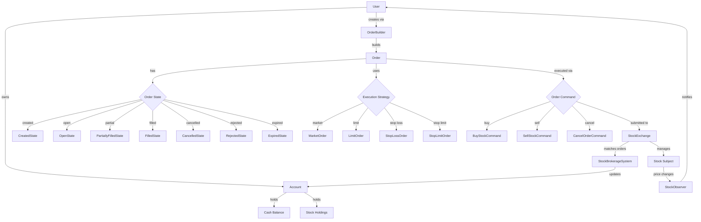
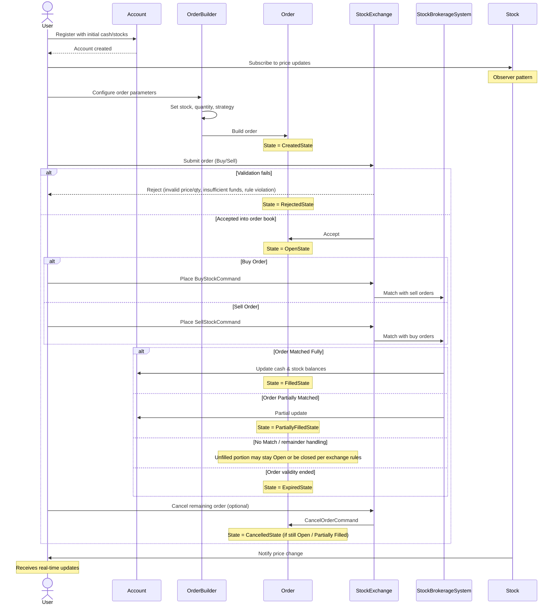

# Online Stock Exchange

## Data Flow Diagram

## Order lifecycle (states)

| State | Meaning |
|-------|---------|
| **Created** | Order object built; not yet accepted by the exchange. |
| **Open (Active)** | Live in the order book; waiting to match with a counter order. |
| **Partially Filled** | Some quantity executed; remainder still open (e.g. buy 100 → 40 filled, 60 pending). |
| **Filled (Executed)** | Entire quantity matched and completed. |
| **Cancelled** | User or system cancels before full execution. |
| **Rejected** | Never reaches execution: invalid price/quantity, insufficient funds, or exchange rule violation. |
| **Expired** | Validity ended (e.g. session or order validity window closed). |

**Typical flow**

`Created → Open → (Partially Filled)* → Filled` **or** `Cancelled` **or** `Expired` **or** `Rejected`

*(Early validation failures can go `Created → Rejected` without ever being **Open**.)*

## User Flow Diagram

