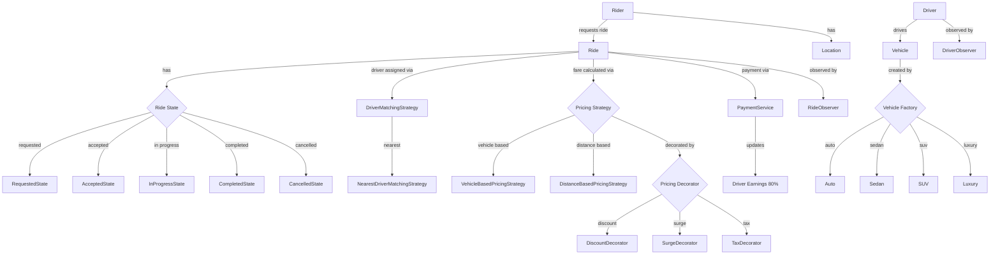
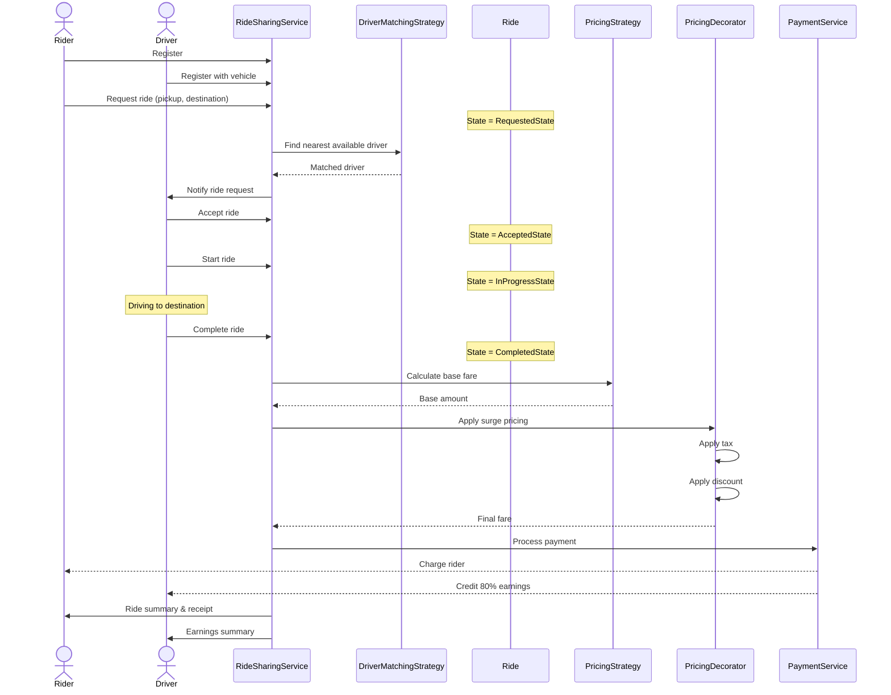

# Ride Sharing Service

## Data Flow Diagram

```mermaid
graph TD
    Rider[Rider] -->|requests ride| Ride[Ride]
    Rider -->|has| Location[Location]
    Driver[Driver] -->|drives| Vehicle[Vehicle]
    Vehicle -->|created by| VehicleFactory{Vehicle Factory}
    VehicleFactory -->|auto| Auto[Auto]
    VehicleFactory -->|sedan| Sedan[Sedan]
    VehicleFactory -->|suv| SUV[SUV]
    VehicleFactory -->|luxury| Luxury[Luxury]

    Ride -->|has| RideState{Ride State}
    RideState -->|requested| RequestedState[RequestedState]
    RideState -->|accepted| AcceptedState[AcceptedState]
    RideState -->|in progress| InProgressState[InProgressState]
    RideState -->|completed| CompletedState[CompletedState]
    RideState -->|cancelled| CancelledState[CancelledState]

    Ride -->|driver assigned via| DriverMatchingStrategy[DriverMatchingStrategy]
    DriverMatchingStrategy -->|nearest| NearestDriver[NearestDriverMatchingStrategy]

    Ride -->|fare calculated via| PricingStrategy{Pricing Strategy}
    PricingStrategy -->|vehicle based| VehicleBased[VehicleBasedPricingStrategy]
    PricingStrategy -->|distance based| DistanceBased[DistanceBasedPricingStrategy]

    PricingStrategy -->|decorated by| PricingDecorator{Pricing Decorator}
    PricingDecorator -->|discount| DiscountDecorator[DiscountDecorator]
    PricingDecorator -->|surge| SurgeDecorator[SurgeDecorator]
    PricingDecorator -->|tax| TaxDecorator[TaxDecorator]

    Ride -->|payment via| PaymentService[PaymentService]
    PaymentService -->|updates| DriverEarnings[Driver Earnings 80%]

    Ride -->|observed by| RideObserver[RideObserver]
    Driver -->|observed by| DriverObserver[DriverObserver]
```

## User Flow Diagram

```mermaid
sequenceDiagram
    actor Rider
    actor Driver
    participant System as RideSharingService
    participant MatchStrategy as DriverMatchingStrategy
    participant Ride
    participant PricingStrategy
    participant PricingDecorator
    participant PaymentService

    Rider->>System: Register
    Driver->>System: Register with vehicle

    Rider->>System: Request ride (pickup, destination)
    Note over Ride: State = RequestedState
    System->>MatchStrategy: Find nearest available driver
    MatchStrategy-->>System: Matched driver

    System->>Driver: Notify ride request
    Driver->>System: Accept ride
    Note over Ride: State = AcceptedState

    Driver->>System: Start ride
    Note over Ride: State = InProgressState
    Note over Driver: Driving to destination

    Driver->>System: Complete ride
    Note over Ride: State = CompletedState

    System->>PricingStrategy: Calculate base fare
    PricingStrategy-->>System: Base amount

    System->>PricingDecorator: Apply surge pricing
    PricingDecorator->>PricingDecorator: Apply tax
    PricingDecorator->>PricingDecorator: Apply discount
    PricingDecorator-->>System: Final fare

    System->>PaymentService: Process payment
    PaymentService-->>Rider: Charge rider
    PaymentService-->>Driver: Credit 80% earnings

    System->>Rider: Ride summary & receipt
    System->>Driver: Earnings summary
```
