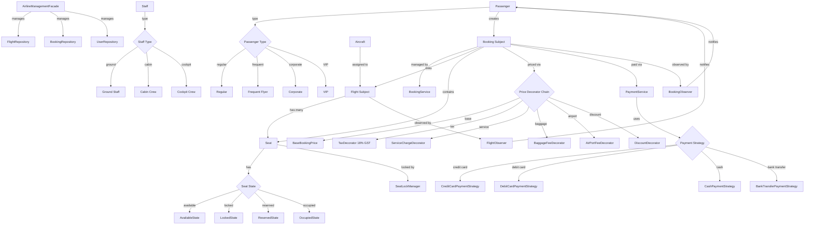
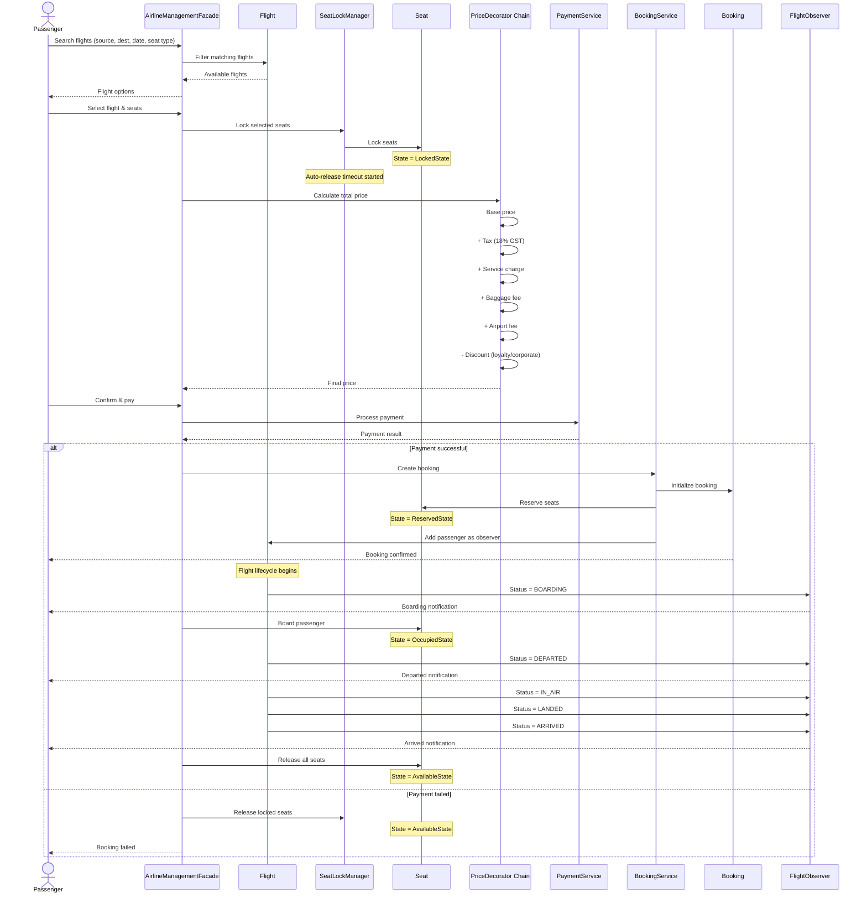

# Airline Management Service

## Data Flow Diagram

```mermaid
graph TD
    Facade[AirlineManagementFacade] -->|manages| FlightRepo[FlightRepository]
    Facade -->|manages| BookingRepo[BookingRepository]
    Facade -->|manages| UserRepo[UserRepository]

    Passenger[Passenger] -->|type| PassengerType{Passenger Type}
    PassengerType -->|regular| Regular[Regular]
    PassengerType -->|frequent| FrequentFlyer[Frequent Flyer]
    PassengerType -->|corporate| Corporate[Corporate]
    PassengerType -->|VIP| VIP[VIP]

    Staff[Staff] -->|type| StaffType{Staff Type}
    StaffType -->|ground| GroundStaff[Ground Staff]
    StaffType -->|cabin| CabinCrew[Cabin Crew]
    StaffType -->|cockpit| CockpitCrew[Cockpit Crew]

    Aircraft[Aircraft] -->|assigned to| Flight[Flight Subject]
    Flight -->|has many| Seat[Seat]
    Seat -->|has| SeatState{Seat State}
    SeatState -->|available| AvailableState[AvailableState]
    SeatState -->|locked| LockedState[LockedState]
    SeatState -->|reserved| ReservedState[ReservedState]
    SeatState -->|occupied| OccupiedState[OccupiedState]

    Seat -->|locked by| SeatLockManager[SeatLockManager]

    Passenger -->|creates| Booking[Booking Subject]
    Booking -->|managed by| BookingService[BookingService]
    Booking -->|links| Flight
    Booking -->|contains| Seat

    Booking -->|priced via| PriceDecorator{Price Decorator Chain}
    PriceDecorator -->|base| BasePrice[BaseBookingPrice]
    PriceDecorator -->|tax| TaxDecorator[TaxDecorator 18% GST]
    PriceDecorator -->|service| ServiceCharge[ServiceChargeDecorator]
    PriceDecorator -->|baggage| BaggageFee[BaggageFeeDecorator]
    PriceDecorator -->|airport| AirportFee[AirPortFeeDecorator]
    PriceDecorator -->|discount| Discount[DiscountDecorator]

    Booking -->|paid via| PaymentService[PaymentService]
    PaymentService -->|uses| PaymentStrategy{Payment Strategy}
    PaymentStrategy -->|credit card| CreditCard[CreditCardPaymentStrategy]
    PaymentStrategy -->|debit card| DebitCard[DebitCardPaymentStrategy]
    PaymentStrategy -->|cash| Cash[CashPaymentStrategy]
    PaymentStrategy -->|bank transfer| BankTransfer[BankTransferPaymentStrategy]

    Flight -->|observed by| FlightObserver[FlightObserver]
    Booking -->|observed by| BookingObserver[BookingObserver]
    FlightObserver -->|notifies| Passenger
    BookingObserver -->|notifies| Passenger
```

## User Flow Diagram

```mermaid
sequenceDiagram
    actor Passenger
    participant Facade as AirlineManagementFacade
    participant Flight
    participant SeatLockMgr as SeatLockManager
    participant Seat
    participant PriceCalc as PriceDecorator Chain
    participant PaymentService
    participant BookingService
    participant Booking
    participant FlightObserver

    Passenger->>Facade: Search flights (source, dest, date, seat type)
    Facade->>Flight: Filter matching flights
    Flight-->>Facade: Available flights
    Facade-->>Passenger: Flight options

    Passenger->>Facade: Select flight & seats
    Facade->>SeatLockMgr: Lock selected seats
    SeatLockMgr->>Seat: Lock seats
    Note over Seat: State = LockedState
    Note over SeatLockMgr: Auto-release timeout started

    Facade->>PriceCalc: Calculate total price
    PriceCalc->>PriceCalc: Base price
    PriceCalc->>PriceCalc: + Tax (18% GST)
    PriceCalc->>PriceCalc: + Service charge
    PriceCalc->>PriceCalc: + Baggage fee
    PriceCalc->>PriceCalc: + Airport fee
    PriceCalc->>PriceCalc: - Discount (loyalty/corporate)
    PriceCalc-->>Facade: Final price

    Passenger->>Facade: Confirm & pay
    Facade->>PaymentService: Process payment
    PaymentService-->>Facade: Payment result

    alt Payment successful
        Facade->>BookingService: Create booking
        BookingService->>Booking: Initialize booking
        BookingService->>Seat: Reserve seats
        Note over Seat: State = ReservedState
        BookingService->>Flight: Add passenger as observer
        Booking-->>Passenger: Booking confirmed

        Note over Flight: Flight lifecycle begins
        Flight->>FlightObserver: Status = BOARDING
        FlightObserver-->>Passenger: Boarding notification
        Facade->>Seat: Board passenger
        Note over Seat: State = OccupiedState

        Flight->>FlightObserver: Status = DEPARTED
        FlightObserver-->>Passenger: Departed notification
        Flight->>FlightObserver: Status = IN_AIR
        Flight->>FlightObserver: Status = LANDED
        Flight->>FlightObserver: Status = ARRIVED
        FlightObserver-->>Passenger: Arrived notification

        Facade->>Seat: Release all seats
        Note over Seat: State = AvailableState
    else Payment failed
        Facade->>SeatLockMgr: Release locked seats
        Note over Seat: State = AvailableState
        Facade-->>Passenger: Booking failed
    end
```
