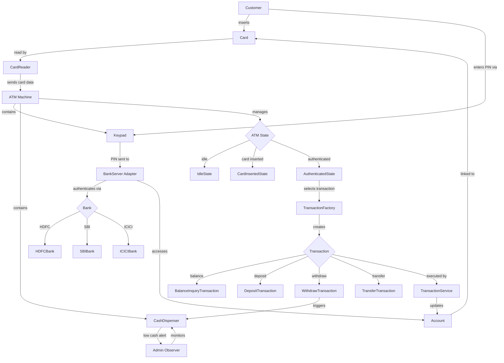
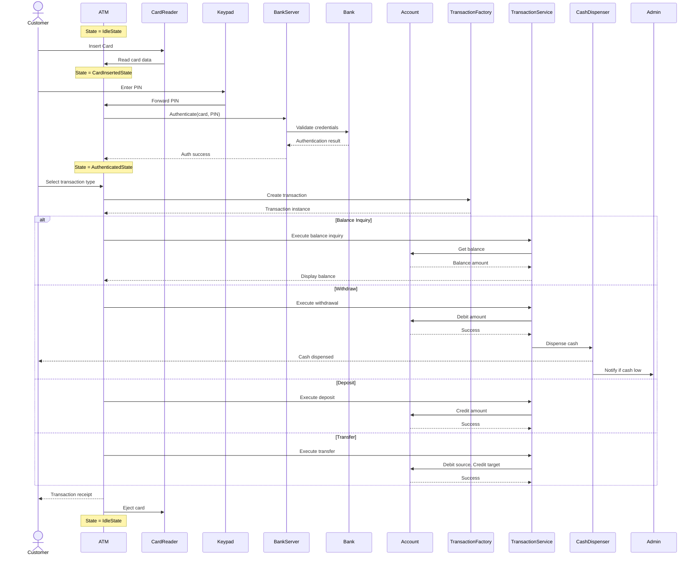

# ATM Machine

## Data Flow Diagram

```mermaid
graph TD
    Customer[Customer] -->|inserts| Card[Card]
    Card -->|read by| CardReader[CardReader]
    CardReader -->|sends card data| ATM[ATM Machine]
    ATM -->|contains| Keypad[Keypad]
    ATM -->|contains| CashDispenser[CashDispenser]
    ATM -->|manages| ATMState{ATM State}

    ATMState -->|idle| IdleState[IdleState]
    ATMState -->|card inserted| CardInsertedState[CardInsertedState]
    ATMState -->|authenticated| AuthenticatedState[AuthenticatedState]

    Customer -->|enters PIN via| Keypad
    Keypad -->|PIN sent to| BankServer[BankServer Adapter]

    BankServer -->|authenticates via| Bank{Bank}
    Bank -->|HDFC| HDFCBank[HDFCBank]
    Bank -->|SBI| SBIBank[SBIBank]
    Bank -->|ICICI| ICICIBank[ICICIBank]

    BankServer -->|accesses| Account[Account]
    Account -->|linked to| Card

    AuthenticatedState -->|selects transaction| TransactionFactory[TransactionFactory]
    TransactionFactory -->|creates| Transaction{Transaction}
    Transaction -->|balance| BalanceInquiry[BalanceInquiryTransaction]
    Transaction -->|deposit| Deposit[DepositTransaction]
    Transaction -->|withdraw| Withdraw[WithdrawTransaction]
    Transaction -->|transfer| Transfer[TransferTransaction]

    Transaction -->|executed by| TransactionService[TransactionService]
    TransactionService -->|updates| Account
    Withdraw -->|triggers| CashDispenser
    CashDispenser -->|low cash alert| Admin[Admin Observer]
    Admin -->|monitors| CashDispenser
```

## User Flow Diagram

```mermaid
sequenceDiagram
    actor Customer
    participant ATM
    participant CardReader
    participant Keypad
    participant BankServer
    participant Bank
    participant Account
    participant TransactionFactory
    participant TransactionService
    participant CashDispenser
    participant Admin

    Note over ATM: State = IdleState
    Customer->>CardReader: Insert Card
    CardReader->>ATM: Read card data
    Note over ATM: State = CardInsertedState

    Customer->>Keypad: Enter PIN
    Keypad->>ATM: Forward PIN
    ATM->>BankServer: Authenticate(card, PIN)
    BankServer->>Bank: Validate credentials
    Bank-->>BankServer: Authentication result
    BankServer-->>ATM: Auth success
    Note over ATM: State = AuthenticatedState

    Customer->>ATM: Select transaction type
    ATM->>TransactionFactory: Create transaction
    TransactionFactory-->>ATM: Transaction instance

    alt Balance Inquiry
        ATM->>TransactionService: Execute balance inquiry
        TransactionService->>Account: Get balance
        Account-->>TransactionService: Balance amount
        TransactionService-->>ATM: Display balance
    else Withdraw
        ATM->>TransactionService: Execute withdrawal
        TransactionService->>Account: Debit amount
        Account-->>TransactionService: Success
        TransactionService->>CashDispenser: Dispense cash
        CashDispenser-->>Customer: Cash dispensed
        CashDispenser->>Admin: Notify if cash low
    else Deposit
        ATM->>TransactionService: Execute deposit
        TransactionService->>Account: Credit amount
        Account-->>TransactionService: Success
    else Transfer
        ATM->>TransactionService: Execute transfer
        TransactionService->>Account: Debit source, Credit target
        Account-->>TransactionService: Success
    end

    ATM-->>Customer: Transaction receipt
    ATM->>CardReader: Eject card
    Note over ATM: State = IdleState
```
