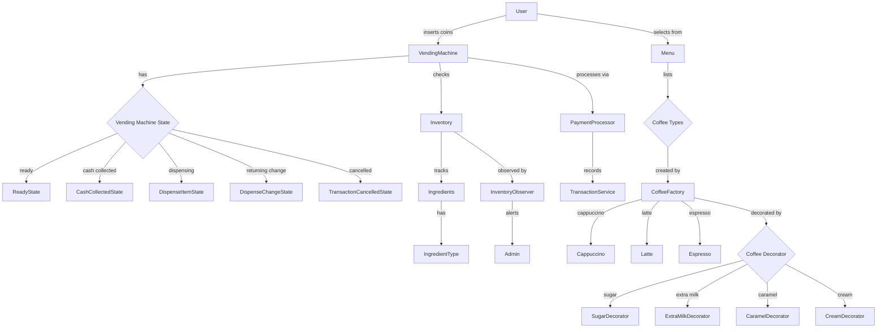
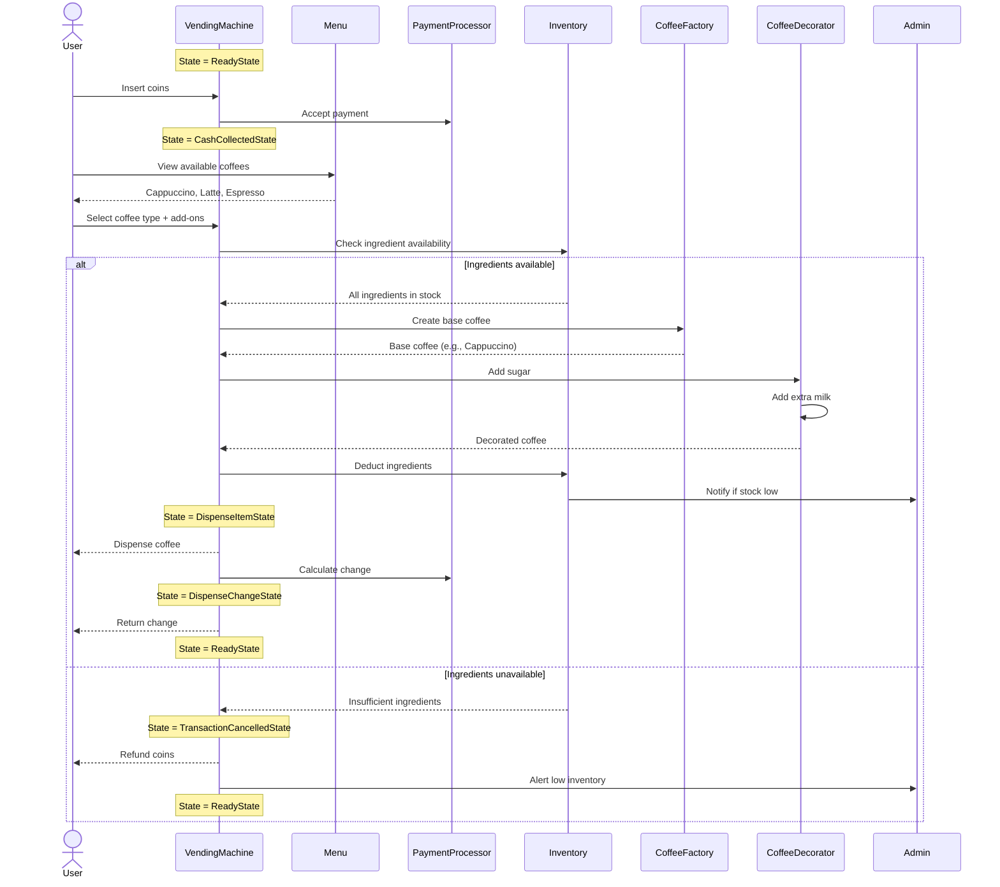

# Coffee Vending Machine

## Data Flow Diagram

```mermaid
graph TD
    User[User] -->|inserts coins| VendingMachine[VendingMachine]
    VendingMachine -->|has| VMState{Vending Machine State}
    VMState -->|ready| ReadyState[ReadyState]
    VMState -->|cash collected| CashCollectedState[CashCollectedState]
    VMState -->|dispensing| DispenseItemState[DispenseItemState]
    VMState -->|returning change| DispenseChangeState[DispenseChangeState]
    VMState -->|cancelled| TransactionCancelledState[TransactionCancelledState]

    User -->|selects from| Menu[Menu]
    Menu -->|lists| CoffeeTypes{Coffee Types}

    CoffeeTypes -->|created by| CoffeeFactory[CoffeeFactory]
    CoffeeFactory -->|cappuccino| Cappuccino[Cappuccino]
    CoffeeFactory -->|latte| Latte[Latte]
    CoffeeFactory -->|espresso| Espresso[Espresso]

    CoffeeFactory -->|decorated by| CoffeeDecorator{Coffee Decorator}
    CoffeeDecorator -->|sugar| Sugar[SugarDecorator]
    CoffeeDecorator -->|extra milk| ExtraMilk[ExtraMilkDecorator]
    CoffeeDecorator -->|caramel| Caramel[CaramelDecorator]
    CoffeeDecorator -->|cream| Cream[CreamDecorator]

    VendingMachine -->|checks| Inventory[Inventory]
    Inventory -->|tracks| Ingredient[Ingredients]
    Ingredient -->|has| IngredientType[IngredientType]

    VendingMachine -->|processes via| PaymentProcessor[PaymentProcessor]
    PaymentProcessor -->|records| TransactionService[TransactionService]

    Inventory -->|observed by| InventoryObserver[InventoryObserver]
    InventoryObserver -->|alerts| Admin[Admin]
```

## User Flow Diagram

```mermaid
sequenceDiagram
    actor User
    participant VM as VendingMachine
    participant Menu
    participant PaymentProcessor
    participant Inventory
    participant CoffeeFactory
    participant CoffeeDecorator
    participant Admin

    Note over VM: State = ReadyState

    User->>VM: Insert coins
    VM->>PaymentProcessor: Accept payment
    Note over VM: State = CashCollectedState

    User->>Menu: View available coffees
    Menu-->>User: Cappuccino, Latte, Espresso

    User->>VM: Select coffee type + add-ons

    VM->>Inventory: Check ingredient availability
    alt Ingredients available
        Inventory-->>VM: All ingredients in stock

        VM->>CoffeeFactory: Create base coffee
        CoffeeFactory-->>VM: Base coffee (e.g., Cappuccino)

        VM->>CoffeeDecorator: Add sugar
        CoffeeDecorator->>CoffeeDecorator: Add extra milk
        CoffeeDecorator-->>VM: Decorated coffee

        VM->>Inventory: Deduct ingredients
        Inventory->>Admin: Notify if stock low

        Note over VM: State = DispenseItemState
        VM-->>User: Dispense coffee

        VM->>PaymentProcessor: Calculate change
        Note over VM: State = DispenseChangeState
        VM-->>User: Return change

        Note over VM: State = ReadyState
    else Ingredients unavailable
        Inventory-->>VM: Insufficient ingredients
        Note over VM: State = TransactionCancelledState
        VM-->>User: Refund coins
        VM->>Admin: Alert low inventory
        Note over VM: State = ReadyState
    end
```
