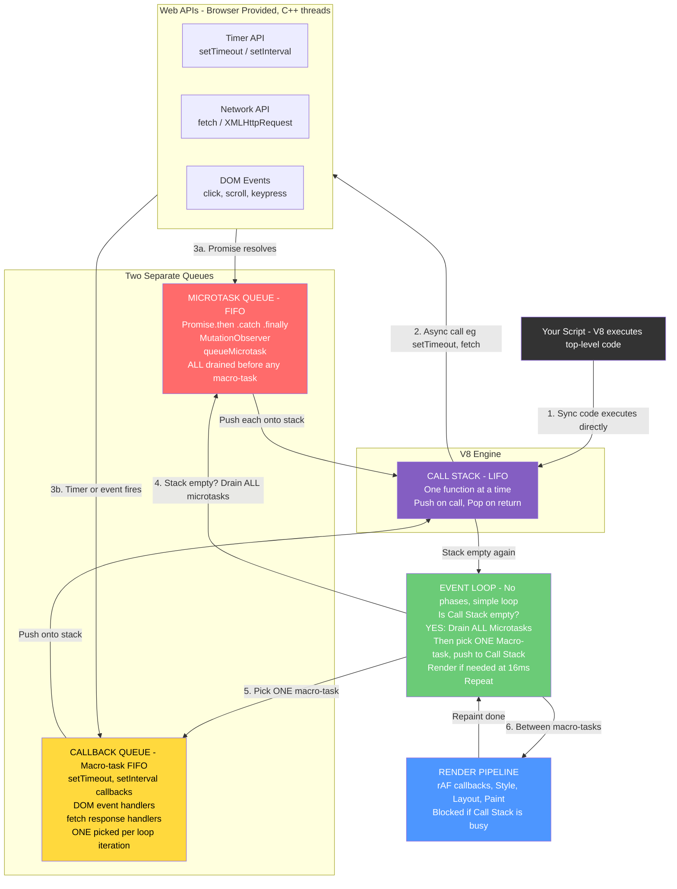
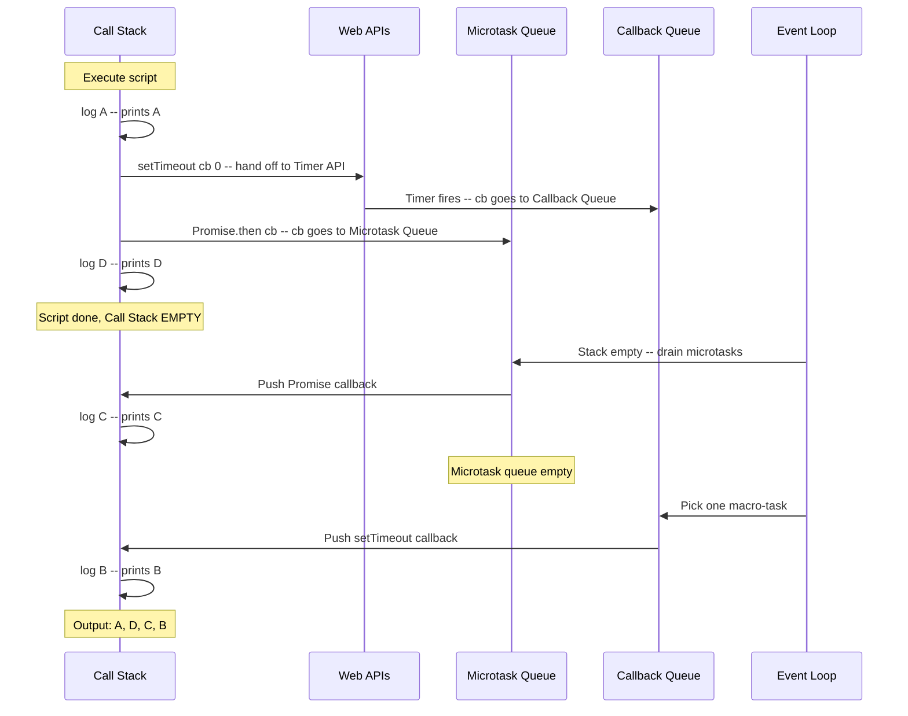
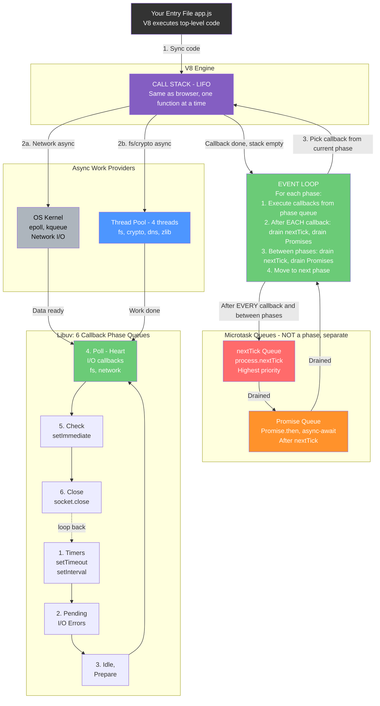
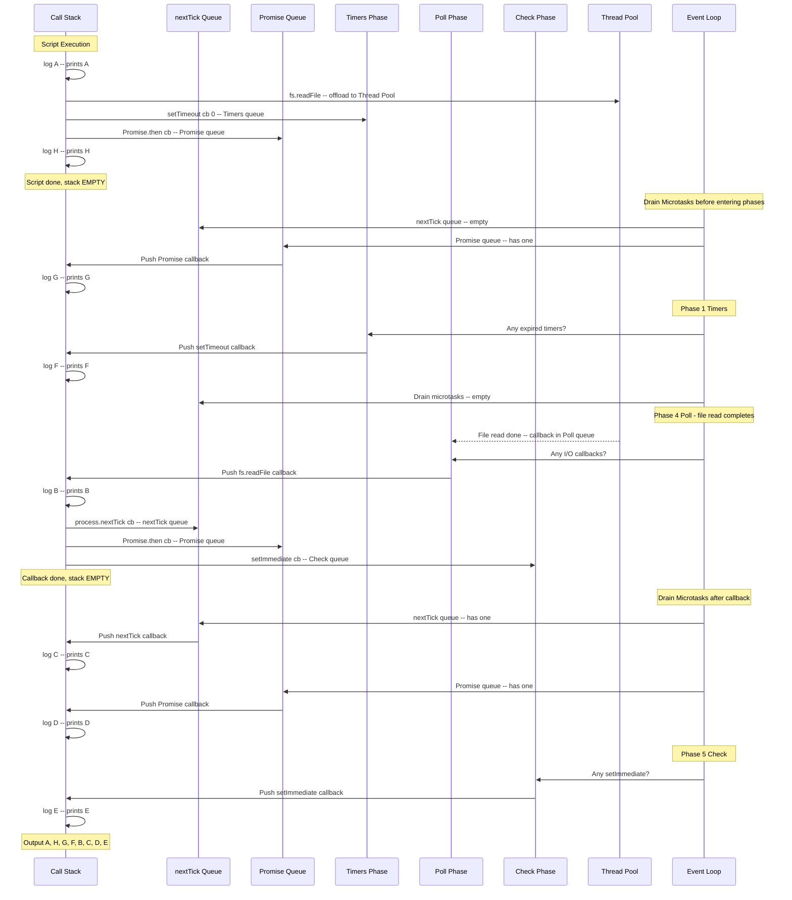
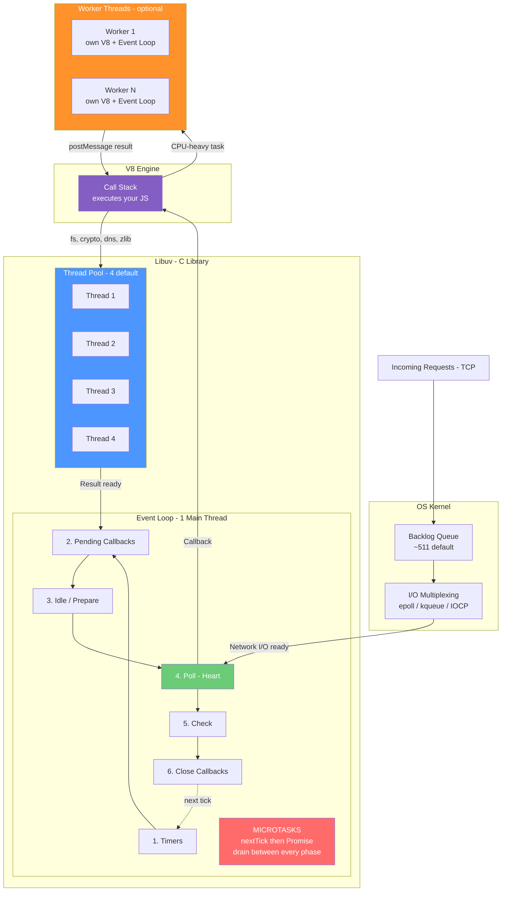

# 🛠️ Node.js Architecture: Event Loop, Concurrency & Worker Threads

This guide covers how Node.js handles thousands of requests, manages asynchronous I/O via Libuv, and processes CPU-heavy tasks without blocking the main thread.

---

## 🌍 1. Browser vs. Node.js Architecture

While both use the V8 Engine, they provide different environments for the Event Loop.

| Feature | Web Browser | Node.js (Backend) |
| :--- | :--- | :--- |
| Provider | Browser Web APIs | Libuv (C library) |
| Standard | HTML5 Spec | Custom Libuv implementation |
| Main Goal | Smooth UI & Rendering | High-throughput I/O |

---

## 📚 1.1 What is the Call Stack?

The Call Stack is a **LIFO (Last In, First Out) data structure** inside the V8 engine. It is NOT a queue. It tracks which function is currently executing and what called it.

- Every time a function is **called**, a new frame is **pushed** onto the stack
- When a function **returns**, its frame is **popped** off the stack
- JavaScript is **single-threaded** — only ONE call stack, only ONE function executes at a time
- If the stack is **not empty**, nothing else can run (no callbacks, no rendering, no events)

```js
function multiply(a, b) { return a * b; }
function square(n) { return multiply(n, n); }
function printSquare(n) { console.log(square(n)); }
printSquare(5);

// Call Stack grows (push):
//   [printSquare] → [printSquare, square] → [printSquare, square, multiply]
// Call Stack shrinks (pop):
//   multiply returns → [printSquare, square] → square returns → [printSquare] → done → []
```

### 🔑 Key Relationship: Call Stack, Queues & Event Loop

These are **three separate structures** that work together:

| Structure | Type | Role |
| :--- | :--- | :--- |
| **Call Stack** | LIFO Stack | Where V8 **executes** functions, one at a time |
| **Microtask Queue** | FIFO Queue | Waiting room for Promises, nextTick (high priority) |
| **Callback Queue** | FIFO Queue(s) | Waiting room for setTimeout, I/O, events (lower priority) |
| **Event Loop** | Coordinator | Moves callbacks FROM queues TO the Call Stack when it's empty |

**The golden rule**: The Event Loop will NEVER push a callback onto the Call Stack until the stack is **completely empty**.

---

## 🌐 1.2 Browser: End-to-End Flow

### How it works step by step

1. **Your script loads** — V8 pushes `<script>` onto the Call Stack and executes line by line
2. **Sync code** runs immediately on the Call Stack (push/pop)
3. **Async calls** (setTimeout, fetch, addEventListener) are handed off to **Browser Web APIs** — these run outside V8, in C++ threads managed by the browser
4. **Web API completes** (timer expires, HTTP response arrives, user clicks) — the callback is placed into:
   - **Microtask Queue** — if it's a Promise `.then`/`.catch`/`.finally` or `MutationObserver`
   - **Callback Queue (Macro-task)** — if it's setTimeout, setInterval, DOM event, fetch completion
5. **Event Loop checks**: Is the Call Stack empty?
   - **YES** → Drain **ALL** microtasks first (push each onto stack, execute, pop)
   - Still empty? → Pick **ONE** macro-task from Callback Queue → push onto stack
   - Between macro-tasks → Run **Render Pipeline** if ~16ms has passed (requestAnimationFrame → Style → Layout → Paint)
   - **NO** → Wait. Do nothing. No callbacks run until the stack is empty
6. **Repeat** forever

**Important**: The browser has NO phases. There is just ONE callback queue (macro-task queue). The Event Loop simply picks one task, runs it, drains microtasks, renders if needed, and repeats. This is much simpler than Node.js which divides its callback queue into 6 phases.

### Browser Event Loop Diagram



### 🌐 Browser: Step-by-Step Walkthrough

```js
console.log('A');                          // 1. Sync → Call Stack
setTimeout(() => console.log('B'), 0);     // 2. → Timer Web API → Callback Queue
Promise.resolve().then(() => console.log('C')); // 3. → Microtask Queue
console.log('D');                          // 4. Sync → Call Stack
```



---

## 🟢 1.3 Node.js: End-to-End Flow

### How it works step by step

1. **Node starts** — V8 executes your entry file top-to-bottom on the Call Stack
2. **Sync code** runs immediately (same as browser)
3. **Async calls** are handed off to **Libuv**:
   - **Network I/O** → OS kernel (epoll/kqueue) — no thread used
   - **File I/O, crypto, dns, zlib** → Libuv Thread Pool (4 threads by default)
4. **When async work completes**, the callback is placed into the appropriate **phase queue**:
   - setTimeout → **Timers** phase queue
   - fs.readFile → **Poll** phase queue
   - setImmediate → **Check** phase queue
   - Promises → **Microtask** queue (separate, not a phase)
   - process.nextTick → **nextTick** queue (separate, highest priority)
5. **Event Loop processes phases in order** (Timers → Pending → Idle → Poll → Check → Close):
   - Enter a phase → execute callbacks from that phase's queue (push each onto Call Stack)
   - **After EVERY single callback**: drain nextTick queue, then drain Promise queue
   - **Between EVERY phase**: drain nextTick queue, then drain Promise queue
   - After Close phase → loop back to Timers
6. **Poll phase is special** — if no callbacks are pending in other phases, the loop **sleeps** here waiting for new I/O events (zero CPU usage)

### Node.js Event Loop Diagram



### 🟢 Node.js: Step-by-Step Walkthrough

```js
const fs = require('fs');
console.log('A');                                    // 1. Sync
fs.readFile('file.txt', () => {                      // 2. → Thread Pool → Poll queue
    console.log('B');
    process.nextTick(() => console.log('C'));         // → nextTick queue
    Promise.resolve().then(() => console.log('D'));   // → Promise queue
    setImmediate(() => console.log('E'));             // → Check queue
});
setTimeout(() => console.log('F'), 0);               // 3. → Timers queue
Promise.resolve().then(() => console.log('G'));       // 4. → Promise queue
console.log('H');                                    // 5. Sync
```



---

## 🔄 1.4 Browser vs Node.js: Key Differences in Event Loop

| Aspect | Browser | Node.js |
| :--- | :--- | :--- |
| **Call Stack** | Same (V8) | Same (V8) |
| **Callback Queue** | Single queue (macro-tasks) | 6 phase queues (Timers, Pending, Idle, Poll, Check, Close) |
| **Microtask Queue** | Promise, MutationObserver | process.nextTick (highest) + Promise |
| **When microtasks drain** | After each macro-task | After EVERY callback AND between EVERY phase |
| **Rendering** | Render Pipeline between tasks (~16ms) | No rendering (backend) |
| **Async I/O provider** | Browser Web APIs (C++ threads) | Libuv (OS kernel + Thread Pool) |
| **Has setImmediate?** | No | Yes (Check phase) |
| **Has process.nextTick?** | No | Yes (highest priority microtask) |
| **Sleeps when idle** | No (browser stays alive for UI) | Yes (Poll phase, zero CPU) |

---

## 🏗️ 2. How a Request is Received and Queued

When a request hits a Node.js server, it flows through this pipeline:

1. **OS Kernel** receives the TCP connection and places it in a backlog queue (configurable via `server.listen(port, backlog)`, default ~511)
2. **Libuv** accepts the connection from the kernel using I/O multiplexing (epoll/kqueue/IOCP)
3. **Node.js HTTP Parser** parses the raw bytes into an HTTP request object
4. **Your Callback** (the request handler you registered) is placed into the **Poll Phase queue** of the Event Loop
5. **Event Loop** picks up your callback and executes it on the **single main thread**

Key point: Node.js does NOT create a new thread per request. All request callbacks land in the Event Loop's phase queues and are executed one at a time on the main thread.

---

## 🟢 3. The Node.js Event Loop (6 Phases)

Node.js has **two types of queues**:

- **Callback Queue (Macro-task Queue)**: Divided into 6 phases, each with its own FIFO queue
- **Microtask Queue**: NOT part of the 6 phases. It is a separate high-priority interrupt (covered in Section 4)

### 🔄 The 6 Phases of the Callback Queue

1. **Timers**: `setTimeout()` and `setInterval()` callbacks whose threshold has elapsed
2. **Pending Callbacks**: System-level I/O error callbacks (e.g., TCP `ECONNREFUSED`)
3. **Idle, Prepare**: Internal Node.js housekeeping (not user-facing)
4. **Poll (The Heart)**: Retrieves new I/O events (file read, network data). If the queue is empty, the loop "blocks" (sleeps) here waiting for new events
5. **Check**: `setImmediate()` callbacks
6. **Close Callbacks**: `socket.on('close')`, cleanup handlers, etc.

The Event Loop iterates through these 6 phases in order, one full cycle = one "tick".

---

## ⚡ 4. The Microtask Queue: The "VIP" Interrupt

Microtasks (`Promise.then`, `process.nextTick`) are NOT a phase. They are a **separate high-priority queue**.

- **Draining**: The loop stops **after every single callback** and **between every phase** to execute every waiting Microtask until the queue is empty
- **Priority Order**: `process.nextTick` queue is drained **before** the `Promise` queue
- **Danger**: An infinite loop of `process.nextTick()` will starve the entire Event Loop — no I/O, no timers, nothing runs

---

## 🚀 5. I/O Multiplexing (Handling 100k+ Requests)

Node.js uses Non-blocking I/O to handle massive concurrency on a single thread.

1. **Delegation**: Node asks the OS (epoll on Linux, kqueue on macOS, IOCP on Windows) to watch thousands of sockets
2. **Sleep**: The Event Loop enters the Poll Phase and sleeps (zero CPU usage)
3. **Wake-up**: When data arrives on any socket, the OS wakes the loop
4. **Efficiency**: The CPU only works when there is code to run, not while waiting for the network

This is why a single Node.js process can handle 100k+ concurrent connections — it never wastes a thread waiting on I/O.

---

## 🧵 6. Libuv Thread Pool (The Hidden Multi-threading)

Not everything can use OS-level async I/O. For these operations, Libuv maintains a **thread pool**.

### Default Configuration

- **Default size**: 4 threads
- **Configurable** via `UV_THREADPOOL_SIZE` environment variable (max 1024)
- Set it before the process starts: `UV_THREADPOOL_SIZE=8 node app.js`

### What runs on the Thread Pool?

| Operation | Runs On |
| :--- | :--- |
| Network I/O (TCP, HTTP, DNS lookup via OS) | OS kernel (epoll/kqueue) — NOT thread pool |
| File System operations (fs.readFile, etc.) | Libuv Thread Pool |
| DNS lookup via `dns.lookup()` (uses getaddrinfo) | Libuv Thread Pool |
| Crypto operations (pbkdf2, scrypt, randomBytes) | Libuv Thread Pool |
| Zlib compression | Libuv Thread Pool |

### How it works

1. Main thread offloads a blocking task (e.g., `fs.readFile`) to one of the 4 pool threads
2. The pool thread performs the blocking operation
3. When done, the result is queued back into the Event Loop (Pending Callbacks phase)
4. Main thread picks it up and runs your callback

### Bottleneck Warning

If you fire 20 `fs.readFile()` calls simultaneously, only 4 run in parallel. The other 16 wait in a queue for a free thread. For I/O-heavy servers, increase `UV_THREADPOOL_SIZE`.

---

## 🧠 7. CPU-Heavy Tasks & Worker Threads

The Libuv thread pool handles Node's own async APIs (fs, crypto, etc.), but if **your application code** performs heavy computation (e.g., Image Processing, Video Encoding, ML inference), the Event Loop freezes. No other requests can be handled.

### ❌ Don't confuse Thread Pool with Worker Threads

| | Libuv Thread Pool | Worker Threads |
| :--- | :--- | :--- |
| Purpose | Node's internal async I/O | Your CPU-bound app code |
| Controlled by | Libuv automatically | You create them explicitly |
| Threads | 4 by default (shared) | As many as you spawn |
| V8 Instance | No (C-level work) | Yes (each has its own V8) |
| Event Loop | No | Yes (each has its own) |

### ✅ The Solution: `worker_threads` module

For CPU-bound tasks in your code, use `worker_threads` to spawn separate threads:

- **Main Thread**: Handles I/O and HTTP requests
- **Worker Thread**: Handles heavy computation (has its own V8 instance and Event Loop)
- **Communication**: Message passing via `postMessage()` / `parentPort.on('message')`
- **Shared Memory**: Optional `SharedArrayBuffer` for zero-copy data sharing

---

## 📊 8. Full Architecture Diagram (Mental Model)



---

## 📝 9. Technical Quiz: Execution Order

Question: What is the output of this code?

Code:

const fs = require('fs');

console.log('1: Start');

setTimeout(() => console.log('2: Timeout'), 0);

fs.readFile(__filename, () => {
    console.log('3: File Read');
    setTimeout(() => console.log('4: Inner Timeout'), 0);
    setImmediate(() => console.log('5: Inner Immediate'));
    process.nextTick(() => console.log('6: Inner NextTick'));
});

Promise.resolve().then(() => console.log('7: Promise'));

console.log('8: End');

---

### 💡 Answer, Output & Explanation (All Together)

Output:

1: Start
8: End
7: Promise
2: Timeout
3: File Read
6: Inner NextTick
5: Inner Immediate
4: Inner Timeout

Explanation:

1. 1: Start (Sync)
2. 8: End (Sync)
3. 7: Promise (Microtask - runs after sync code, before any phase)
4. 2: Timeout (Timers phase)
5. 3: File Read (Poll phase callback)
6. 6: Inner NextTick (Microtask - drains immediately after the poll callback, before moving to next phase)
7. 5: Inner Immediate (Check phase - always runs after Poll when scheduled from within a Poll callback)
8. 4: Inner Timeout (Next loop iteration - Timers phase)

---

## 📌 Critical Revision Summary

- **Infrastructure**: Event Loop is provided by Libuv, not V8
- **Request Flow**: OS kernel → Libuv → Event Loop phase queues → V8 executes callback
- **Two Queue Types**: Callback queue (6 phases) + Microtask queue (separate, higher priority)
- **Microtask Logic**: Microtasks drain between every callback and between every phase
- **The Heart**: Poll Phase is where Node waits for new I/O events
- **Thread Pool**: 4 threads by default (Libuv) for fs, crypto, dns, zlib — NOT for network I/O
- **Worker Threads**: For YOUR CPU-bound code — separate V8 instance, separate Event Loop
- **Golden Rule**: Do not block the Event Loop
