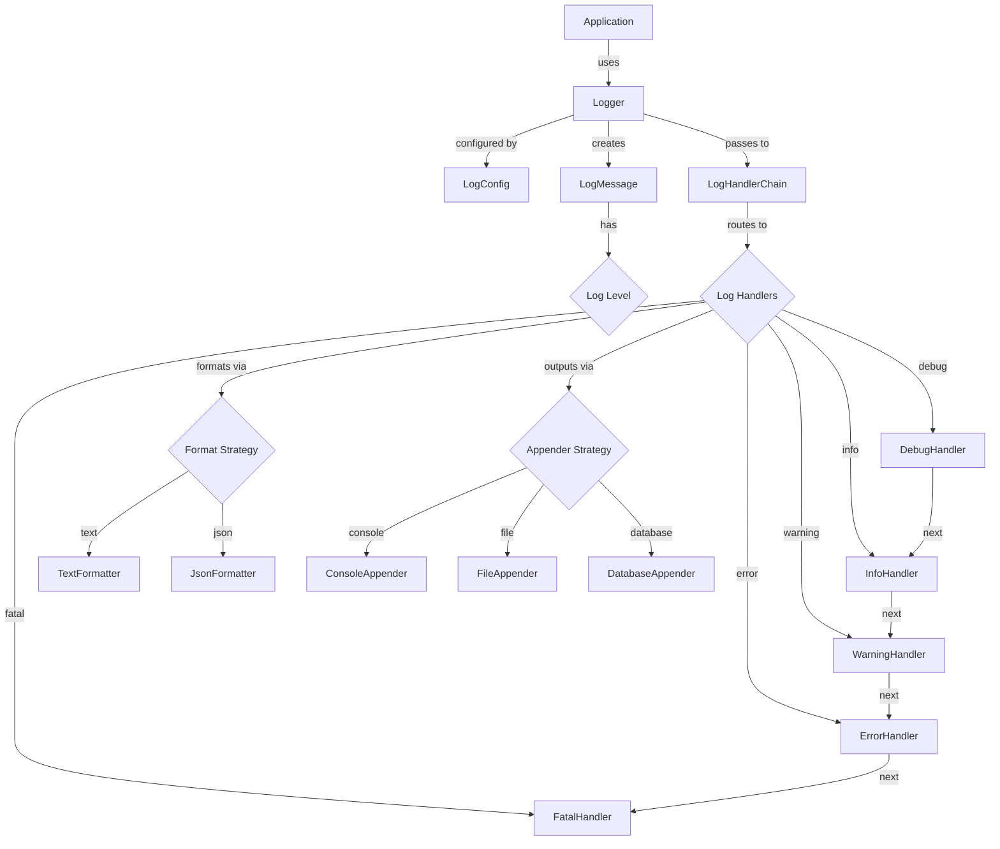
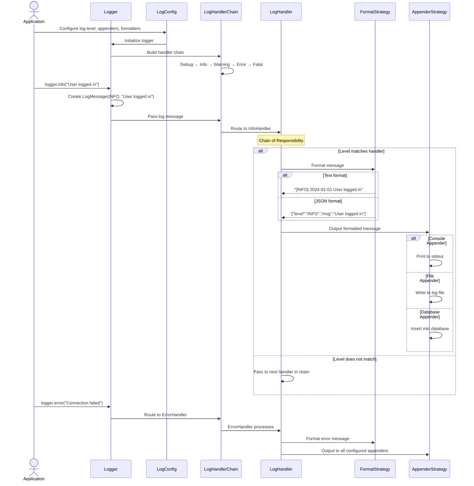

# Logging Framework

## Data Flow Diagram

```mermaid
graph TD
    Application[Application] -->|uses| Logger[Logger]
    Logger -->|configured by| LogConfig[LogConfig]
    Logger -->|creates| LogMessage[LogMessage]
    LogMessage -->|has| LogLevel{Log Level}

    Logger -->|passes to| LogHandlerChain[LogHandlerChain]
    LogHandlerChain -->|routes to| Handler{Log Handlers}
    Handler -->|debug| DebugHandler[DebugHandler]
    Handler -->|info| InfoHandler[InfoHandler]
    Handler -->|warning| WarningHandler[WarningHandler]
    Handler -->|error| ErrorHandler[ErrorHandler]
    Handler -->|fatal| FatalHandler[FatalHandler]

    DebugHandler -->|next| InfoHandler
    InfoHandler -->|next| WarningHandler
    WarningHandler -->|next| ErrorHandler
    ErrorHandler -->|next| FatalHandler

    Handler -->|formats via| FormatStrategy{Format Strategy}
    FormatStrategy -->|text| TextFormatter[TextFormatter]
    FormatStrategy -->|json| JsonFormatter[JsonFormatter]

    Handler -->|outputs via| AppenderStrategy{Appender Strategy}
    AppenderStrategy -->|console| ConsoleAppender[ConsoleAppender]
    AppenderStrategy -->|file| FileAppender[FileAppender]
    AppenderStrategy -->|database| DatabaseAppender[DatabaseAppender]
```

## User Flow Diagram

```mermaid
sequenceDiagram
    actor Application
    participant Logger
    participant LogConfig
    participant HandlerChain as LogHandlerChain
    participant Handler as LogHandler
    participant Formatter as FormatStrategy
    participant Appender as AppenderStrategy

    Application->>LogConfig: Configure log level, appenders, formatters
    LogConfig->>Logger: Initialize logger
    Logger->>HandlerChain: Build handler chain
    HandlerChain->>HandlerChain: Debug → Info → Warning → Error → Fatal

    Application->>Logger: logger.info("User logged in")
    Logger->>Logger: Create LogMessage(INFO, "User logged in")
    Logger->>HandlerChain: Pass log message

    HandlerChain->>Handler: Route to InfoHandler
    Note over Handler: Chain of Responsibility

    alt Level matches handler
        Handler->>Formatter: Format message
        alt Text format
            Formatter-->>Handler: "[INFO] 2024-01-01 User logged in"
        else JSON format
            Formatter-->>Handler: '{"level":"INFO","msg":"User logged in"}'
        end

        Handler->>Appender: Output formatted message
        alt Console Appender
            Appender->>Appender: Print to stdout
        else File Appender
            Appender->>Appender: Write to log file
        else Database Appender
            Appender->>Appender: Insert into database
        end
    else Level does not match
        Handler->>Handler: Pass to next handler in chain
    end

    Application->>Logger: logger.error("Connection failed")
    Logger->>HandlerChain: Route to ErrorHandler
    HandlerChain->>Handler: ErrorHandler processes
    Handler->>Formatter: Format error message
    Handler->>Appender: Output to all configured appenders
```
