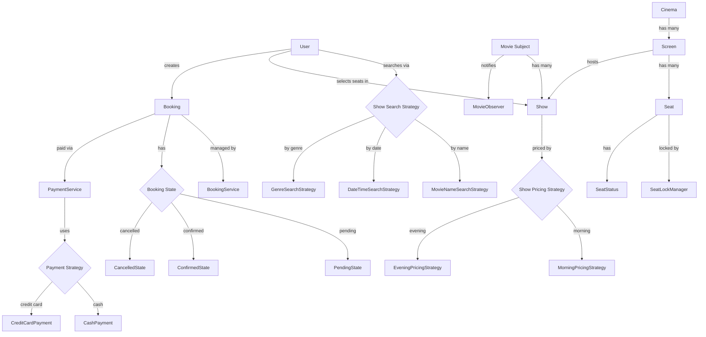
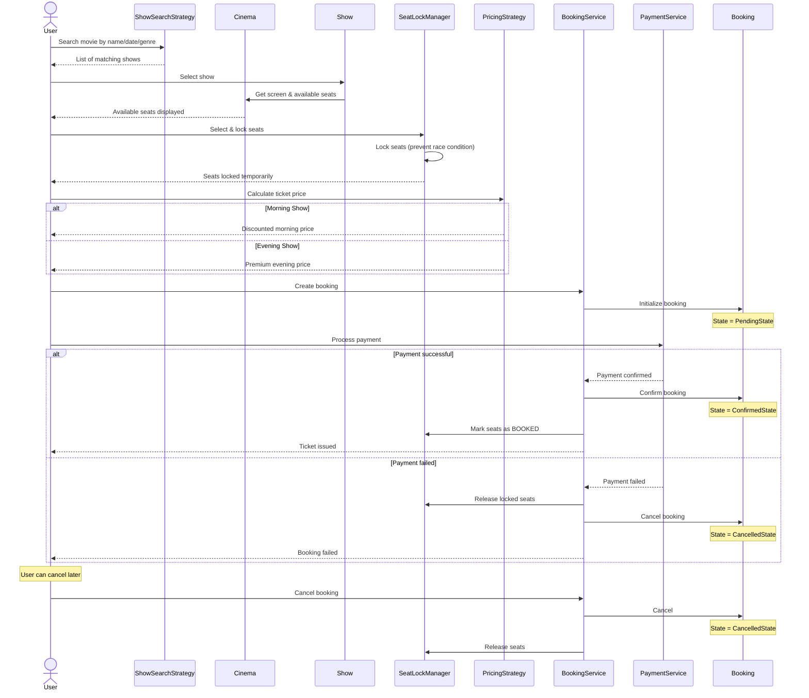

# Movie Ticket Booking Service

## Data Flow Diagram

```mermaid
graph TD
    User[User] -->|searches via| SearchStrategy{Show Search Strategy}
    SearchStrategy -->|by name| MovieNameSearch[MovieNameSearchStrategy]
    SearchStrategy -->|by date| DateTimeSearch[DateTimeSearchStrategy]
    SearchStrategy -->|by genre| GenreSearch[GenreSearchStrategy]

    Movie[Movie Subject] -->|has many| Show[Show]
    Movie -->|notifies| MovieObserver[MovieObserver]

    Cinema[Cinema] -->|has many| Screen[Screen]
    Screen -->|has many| Seat[Seat]
    Screen -->|hosts| Show

    Show -->|priced by| PricingStrategy{Show Pricing Strategy}
    PricingStrategy -->|morning| MorningPricing[MorningPricingStrategy]
    PricingStrategy -->|evening| EveningPricing[EveningPricingStrategy]

    User -->|selects seats in| Show
    Seat -->|locked by| SeatLockManager[SeatLockManager]
    Seat -->|has| SeatStatus[SeatStatus]

    User -->|creates| Booking[Booking]
    Booking -->|managed by| BookingService[BookingService]
    Booking -->|has| BookingState{Booking State}
    BookingState -->|pending| PendingState[PendingState]
    BookingState -->|confirmed| ConfirmedState[ConfirmedState]
    BookingState -->|cancelled| CancelledState[CancelledState]

    Booking -->|paid via| PaymentService[PaymentService]
    PaymentService -->|uses| PaymentStrategy{Payment Strategy}
    PaymentStrategy -->|cash| CashPayment[CashPayment]
    PaymentStrategy -->|credit card| CreditCardPayment[CreditCardPayment]
```

## User Flow Diagram

```mermaid
sequenceDiagram
    actor User
    participant SearchStrategy as ShowSearchStrategy
    participant Cinema
    participant Show
    participant SeatLockMgr as SeatLockManager
    participant PricingStrategy
    participant BookingService
    participant PaymentService
    participant Booking

    User->>SearchStrategy: Search movie by name/date/genre
    SearchStrategy-->>User: List of matching shows

    User->>Show: Select show
    Show->>Cinema: Get screen & available seats
    Cinema-->>User: Available seats displayed

    User->>SeatLockMgr: Select & lock seats
    SeatLockMgr->>SeatLockMgr: Lock seats (prevent race condition)
    SeatLockMgr-->>User: Seats locked temporarily

    User->>PricingStrategy: Calculate ticket price
    alt Morning Show
        PricingStrategy-->>User: Discounted morning price
    else Evening Show
        PricingStrategy-->>User: Premium evening price
    end

    User->>BookingService: Create booking
    BookingService->>Booking: Initialize booking
    Note over Booking: State = PendingState

    User->>PaymentService: Process payment
    alt Payment successful
        PaymentService-->>BookingService: Payment confirmed
        BookingService->>Booking: Confirm booking
        Note over Booking: State = ConfirmedState
        BookingService->>SeatLockMgr: Mark seats as BOOKED
        BookingService-->>User: Ticket issued
    else Payment failed
        PaymentService-->>BookingService: Payment failed
        BookingService->>SeatLockMgr: Release locked seats
        BookingService->>Booking: Cancel booking
        Note over Booking: State = CancelledState
        BookingService-->>User: Booking failed
    end

    Note over User: User can cancel later
    User->>BookingService: Cancel booking
    BookingService->>Booking: Cancel
    Note over Booking: State = CancelledState
    BookingService->>SeatLockMgr: Release seats
```
