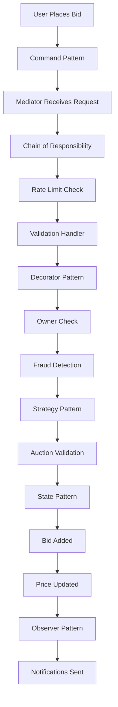
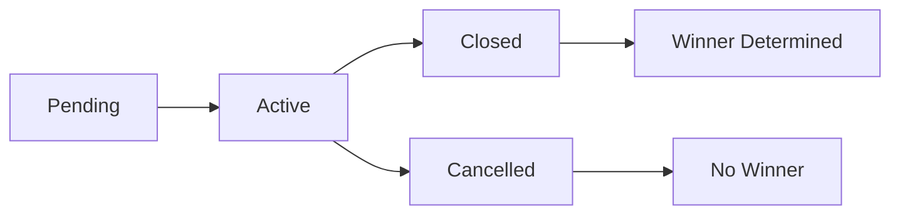

# 🏛️ Online Auction System

A comprehensive, enterprise-grade online auction system built with modern software design patterns and best practices. This system demonstrates advanced object-oriented design principles and provides a robust foundation for scalable auction platforms.

## 📋 Table of Contents

- [Overview](#overview)
- [Architecture](#architecture)
- [Design Patterns](#design-patterns)
- [System Components](#system-components)
- [Data Flow](#data-flow)
- [User Flow](#user-flow)
- [Features](#features)
- [Installation](#installation)
- [Usage](#usage)
- [API Reference](#api-reference)
- [Demo](#demo)
- [Contributing](#contributing)
- [License](#license)

## 🎯 Overview

The Online Auction System is a sophisticated platform that enables users to create, participate in, and manage various types of auctions. Built with clean architecture principles, it showcases multiple design patterns working together to create a maintainable, extensible, and scalable system.

### Key Highlights

- **Multiple Auction Types**: English, Dutch, and Sealed Bid auctions
- **Real-time Bidding**: Live bid updates with observer notifications
- **Rate Limiting**: Built-in protection against abuse
- **Concurrent Access**: Thread-safe operations for high-traffic scenarios
- **Extensible Design**: Easy to add new auction types and features

## 🏗️ Architecture

The system follows a layered architecture with clear separation of concerns:

```
┌─────────────────────────────────────────────────────────────┐
│                    Presentation Layer                       │
│  ┌─────────────────┐                                        │
│  │   Demo Script   │                                        │
│  └─────────────────┘                                        │
└─────────────────────────────────────────────────────────────┘
┌─────────────────────────────────────────────────────────────┐
│                    Application Layer                        │
│  ┌─────────────────┐  ┌─────────────────┐                   │
│  │   Commands      │  │   Mediator      │                   │
│  └─────────────────┘  └─────────────────┘                   │
└─────────────────────────────────────────────────────────────┘
┌─────────────────────────────────────────────────────────────┐
│                     Domain Layer                            │
│  ┌─────────────────┐  ┌─────────────────┐  ┌─────────────┐  │
│  │   Models        │  │   Strategies    │  │   States    │  │
│  └─────────────────┘  └─────────────────┘  └─────────────┘  │
└─────────────────────────────────────────────────────────────┘
┌─────────────────────────────────────────────────────────────┐
│                  Infrastructure Layer                       │
│  ┌─────────────────┐  ┌─────────────────┐                   │
│  │   Repositories  │  │   Services      │                   │
│  └─────────────────┘  └─────────────────┘                   │
└─────────────────────────────────────────────────────────────┘
```

## 🎨 Design Patterns

The system implements multiple design patterns to achieve clean, maintainable, and extensible code:

### 1. **Mediator Pattern** 🎭

**Purpose**: Centralized communication between components
**Implementation**: `AuctionMediator` coordinates between users, auctions, and bids
**Benefits**: Reduces coupling, simplifies component interactions

```python
# Components communicate through mediator
mediator.handle_bid_placement(bid)
mediator.handle_auction_state_change(auction, ActionType.START_AUCTION)
```

### 2. **Chain of Responsibility** ⛓️

**Purpose**: Sequential request processing with multiple handlers
**Implementation**: `RateLimitHandler` → `ValidationHandler` → `Auction`
**Benefits**: Flexible request processing, easy to add/remove handlers

```python
# Request flows through chain
rate_limit_handler.set_next(validation_handler)
validation_handler.set_next(auction_handler)
```

### 3. **Command Pattern** 📝

**Purpose**: Encapsulate operations as objects
**Implementation**: `PlaceBidCommand`, `RemoveBidCommand`, `StartAuctionCommand`
**Benefits**: Undo/redo capability, queuing, logging

```python
# Commands encapsulate operations
command = PlaceBidCommand(bid)
command.execute()  # Execute operation
command.undo()      # Undo operation
```

### 4. **Strategy Pattern** 🎯

**Purpose**: Define family of algorithms and make them interchangeable
**Implementation**: `EnglishAuctionStrategy`, `DutchAuctionStrategy`, `SealedBidAuctionStrategy`
**Benefits**: Easy to add new auction types, runtime algorithm selection

```python
# Different strategies for different auction types
english_auction = EnglishAuction(owner, item, start_time, end_time, price)
dutch_auction = DutchAuction(owner, item, start_time, end_time, price)
```

### 5. **State Pattern** 🔄

**Purpose**: Allow object to alter behavior when internal state changes
**Implementation**: `PendingAuctionState`, `ActiveAuctionState`, `ClosedAuctionState`
**Benefits**: Clean state transitions, state-specific behavior

```python
# State-specific behavior
auction.start_auction()  # Transitions to ActiveAuctionState
auction.end_auction()    # Transitions to ClosedAuctionState
```

### 6. **Observer Pattern** 👀

**Purpose**: Define one-to-many dependency between objects
**Implementation**: `AuctionSubject` notifies `AuctionObserver` instances
**Benefits**: Loose coupling, dynamic subscription

```python
# Observers get notified of changes
auction.add_observer(user)
auction.notify_observers_on_bid(bid)
```

### 7. **Decorator Pattern** 🎨

**Purpose**: Add behavior to objects dynamically
**Implementation**: `OwnerCheckDecorator`, `FraudDetectionDecorator`
**Benefits**: Flexible composition, single responsibility

```python
# Decorators add validation layers
validator = FraudDetectionDecorator(OwnerCheckDecorator(ConcreteAuctionValidator()))
```

### 8. **Component Pattern** 🧩

**Purpose**: Reusable base for mediator participants
**Implementation**: `AuctionComponent` base class
**Benefits**: Consistent interface, mediator integration

```python
# All mediator participants inherit from AuctionComponent
class User(AuctionObserver, AuctionComponent):
class Auction(AuctionSubject, AuctionComponent):
```

## 🏢 System Components

### Core Models

#### **User** 👤

- **Responsibilities**: User management, bidding history, authentication
- **Key Methods**: `place_bid_on_auction()`, `remove_bid_from_auction()`
- **Patterns**: Observer, Component

#### **Auction** 🏛️

- **Responsibilities**: Auction lifecycle, bid management, winner determination
- **Key Methods**: `place_bid()`, `remove_bid()`, `determine_winner()`
- **Patterns**: Subject, Component, State

#### **Bid** 💰

- **Responsibilities**: Bid representation, validation
- **Key Methods**: `get_amount()`, `get_user()`, `get_auction()`
- **Patterns**: Value Object

#### **AuctionItem** 📦

- **Responsibilities**: Item representation, metadata
- **Key Methods**: `get_name()`, `get_description()`, `get_starting_price()`
- **Patterns**: Value Object

### Auction Types

#### **English Auction** 📈

- **Behavior**: Ascending price, highest bid wins
- **Strategy**: `EnglishAuctionStrategy`
- **Validation**: Bid must be higher than current price

#### **Dutch Auction** 📉

- **Behavior**: Descending price, first to accept wins
- **Strategy**: `DutchAuctionStrategy`
- **Validation**: Bid must be lower than current price

#### **Sealed Bid Auction** 🔒

- **Behavior**: Hidden bids, highest bid wins
- **Strategy**: `SealedBidAuctionStrategy`
- **Validation**: Any bid amount accepted

### Services & Handlers

#### **RateLimitHandler** ⏱️

- **Purpose**: Prevent abuse with request rate limiting
- **Configuration**: 5 requests per minute per user
- **Implementation**: Chain of Responsibility pattern

#### **ValidationHandler** ✅

- **Purpose**: Validate bid placement requests
- **Implementation**: Chain of Responsibility pattern
- **Integration**: Uses auction's `can_place_bid()` method

#### **AuctionMediator** 🎭

- **Purpose**: Centralized coordination between components
- **Responsibilities**: Component registration, request delegation
- **Integration**: Chain of Responsibility, Command pattern

## 🔄 Data Flow

### Bid Placement Flow



### Auction State Transition Flow



## 👥 User Flow

### 1. **User Registration** 📝

```python
# Create and register user
user = User("Arjun Sharma", "arjun@email.com", "password123")
mediator.register_component(user)
```

### 2. **Auction Creation** 🏗️

```python
# Create auction item
item = AuctionItem("Vintage Guitar", "Beautiful vintage guitar", 1000.0, AuctionItemType.PHYSICAL)

# Create auction
auction = EnglishAuction(owner=user, item=item, start_time=now, end_time=later, starting_price=1000.0)
mediator.register_component(auction)
```

### 3. **Auction Management** ⚙️

```python
# Start auction
auction.start_auction()  # State: Pending → Active

# End auction
auction.end_auction()    # State: Active → Closed
```

### 4. **Bidding Process** 💰

```python
# Place bid
bid = Bid(user, auction, 1200.0)
command = PlaceBidCommand(bid)
success = command.execute()

# Remove bid (direct method call)
success = auction.remove_bid(bid)
```

### 5. **Winner Determination** 🏆

```python
# Determine winner
winner = auction.determine_winner()
final_price = auction.get_current_price()
```

## ✨ Features

### Core Features

- ✅ **User Management**: Registration and profile management
- ✅ **Auction Creation**: Multiple auction types with flexible configuration
- ✅ **Real-time Bidding**: Live bid updates with instant notifications
- ✅ **Bid Management**: Place, remove, and track bids
- ✅ **Winner Determination**: Automatic winner selection based on auction type
- ✅ **State Management**: Complete auction lifecycle management

### Advanced Features

- ✅ **Rate Limiting**: Protection against abuse (5 requests/minute)
- ✅ **Concurrent Access**: Thread-safe operations for high-traffic scenarios
- ✅ **Observer Notifications**: Real-time updates for all interested parties
- ✅ **Command Undo**: Ability to undo bid operations
- ✅ **Fraud Detection**: Built-in validation for bid amounts
- ✅ **Owner Protection**: Prevents auction owners from bidding on their own auctions

### Search & Payment Features

- ✅ **Search Functionality**: Browse auctions by title, price range, and status
- ✅ **Payment Processing**: Credit card, debit card, and cash payment methods
- ✅ **Repository Pattern**: Centralized data management
- ✅ **Service Layer**: Modular service architecture

### Extensibility Features

- ✅ **Plugin Architecture**: Easy to add new auction types
- ✅ **Decorator Chain**: Flexible validation composition
- ✅ **Handler Chain**: Extensible request processing
- ✅ **Strategy Pattern**: Runtime algorithm selection

## 🚀 Installation

### Prerequisites

- Python 3.8+
- pip (Python package manager)

### Setup Instructions

1. **Clone the repository**

```bash
git clone https://github.com/your-username/online-auction-system.git
cd online-auction-system
```

2. **Create virtual environment**

```bash
python -m venv venv
source venv/bin/activate  # On Windows: venv\Scripts\activate
```

3. **Run the demo**

```bash
python online_auction_system_demo.py
```

## 📖 Usage

### Basic Usage

```python
from app.models.user import User
from app.models.auction import EnglishAuction
from app.models.bid import Bid
from app.mediator.auction_mediator import ConcreteAuctionMediator
from app.commands.auction_command import PlaceBidCommand

# Initialize system
mediator = ConcreteAuctionMediator()

# Create users
user1 = User("Alice", "alice@email.com", "password123")
user2 = User("Bob", "bob@email.com", "password123")

# Register users
mediator.register_component(user1)
mediator.register_component(user2)

# Create auction
auction = EnglishAuction(
    owner=user1,
    item=AuctionItem("Laptop", "Gaming laptop", 1000.0, AuctionItemType.PHYSICAL),
    start_time=datetime.now(),
    end_time=datetime.now() + timedelta(hours=1),
    starting_price=1000.0
)

# Register auction
mediator.register_component(auction)

# Start auction
auction.start_auction()

# Place bid
bid = Bid(user2, auction, 1200.0)
command = PlaceBidCommand(bid)
success = command.execute()

# End auction and determine winner
auction.end_auction()
winner = auction.determine_winner()
```

### Running the Demo

The easiest way to see the system in action is to run the comprehensive demo:

```bash
cd low_level_design/onlineAuctionSystem
python online_auction_system_demo.py
```

This will demonstrate all features including:

- User registration and management
- Multiple auction types (English, Dutch, Sealed Bid)
- Bidding workflow with validation
- Search functionality
- Payment processing
- Concurrent bidding
- Winner determination

### Advanced Usage

#### Custom Auction Strategy

```python
class CustomAuctionStrategy(AuctionStrategy):
    def can_place_bid(self, auction, bid):
        # Custom validation logic
        return super().can_place_bid(auction, bid) and bid.get_amount() > 500.0
```

#### Custom Decorator

```python
class CustomValidationDecorator(AuctionValidatorDecorator):
    def can_place_bid(self, auction, bid):
        # Custom validation
        if bid.get_amount() % 100 != 0:
            return False
        return super().can_place_bid(auction, bid)
```

## 📚 API Reference

### Core Classes

#### `User`

```python
class User(AuctionObserver, AuctionComponent):
    def __init__(self, name: str, email: str, password: str)
    def place_bid_on_auction(self, bid: Bid) -> bool
    def remove_bid_from_auction(self, bid: Bid) -> bool
    def get_bidding_history(self) -> list[Bid]
```

#### `Auction`

```python
class Auction(AuctionSubject, AuctionComponent):
    def __init__(self, owner: User, item: AuctionItem, start_time: datetime, end_time: datetime, starting_price: float, auction_type: AuctionType)
    def place_bid(self, bid: Bid) -> bool
    def remove_bid(self, bid: Bid) -> bool
    def determine_winner(self) -> User
    def start_auction(self) -> None
    def end_auction(self) -> None
```

#### `AuctionMediator`

```python
class ConcreteAuctionMediator(AuctionMediator):
    def register_component(self, component: AuctionComponent) -> None
    def handle_bid_placement(self, bid: Bid) -> bool
    def handle_bid_removal(self, bid: Bid) -> bool
    def handle_auction_state_change(self, auction: Auction, action_type: ActionType) -> None
```

### Commands

#### `PlaceBidCommand`

```python
class PlaceBidCommand(BaseCommand):
    def __init__(self, bid: Bid)
    def execute(self) -> bool
    def undo(self) -> bool
```

## 🎮 Demo

The system includes a comprehensive demo script that showcases all features and design patterns:

### Running the Demo

```bash
cd low_level_design/onlineAuctionSystem
python online_auction_system_demo.py
```

### Demo Features

The demo script demonstrates:

- **User Registration**: Creating and registering multiple users
- **Auction Creation**: Setting up English, Dutch, and Sealed Bid auctions
- **Bidding Process**: Placing bids using the Command pattern
- **State Management**: Starting and ending auctions
- **Observer Pattern**: Real-time notifications for bid updates
- **Rate Limiting**: Protection against abuse (5 requests/minute)
- **Concurrent Bidding**: Thread-safe operations
- **Winner Determination**: Automatic winner selection
- **Bid Removal**: Testing undo functionality
- **Search Functionality**: Title and price range search
- **Payment Processing**: Credit card, debit card, and cash payments

### Demo Output

The demo provides clean, concise output showing:

- System initialization and user registration
- Bidding workflow for all auction types
- Bid removal and price updates
- Search functionality results
- Payment processing for different methods
- Concurrent bidding test results
- Final auction results and winners

### Sample Output

```
🏛️ ONLINE AUCTION SYSTEM DEMO
==================================================
✅ System initialized
✅ Registered 5 users
✅ Created 3 auctions
✅ All auctions started

📈 BIDDING WORKFLOW
--------------------
English Auction Bidding:
   ✅ Priya Patel bid ₹1200.0
   ✅ Rahul Singh bid ₹1500.0
   ✅ Sneha Gupta bid ₹1800.0
   ✅ Vikram Kumar bid ₹2000.0
   ✅ Priya Patel bid ₹2200.0
   Final price: ₹2200.0
   Winner: Priya Patel

🔍 SEARCH FUNCTIONALITY
--------------------
Search by title 'guitar': Found 0 auction(s)
Search by price range ₹500-₹1500: Found 2 auction(s)

💳 PAYMENT PROCESSING
--------------------
Credit Card Payment: All amounts processed successfully
Debit Card Payment: All amounts processed successfully
Cash Payment: All amounts processed successfully

🏁 AUCTION RESULTS
--------------------
Guitar Auction - Winner: Vikram Kumar | Price: ₹2000.0
Painting Auction - Winner: None | Price: ₹2000.0
Software Auction - Winner: None | Price: ₹500.0

✅ DEMO COMPLETED
All requirements demonstrated successfully!
```

## 🤝 Contributing

We welcome contributions! Please follow these guidelines:

### Development Setup

1. Fork the repository
2. Create a feature branch: `git checkout -b feature/amazing-feature`
3. Make your changes
4. Test your changes by running the demo
5. Commit your changes: `git commit -m 'Add amazing feature'`
6. Push to the branch: `git push origin feature/amazing-feature`
7. Open a Pull Request

### Code Style

- Follow PEP 8 guidelines
- Use type hints for all function parameters and return values
- Write comprehensive docstrings
- Ensure the demo runs successfully with your changes

### Pull Request Process

1. Update documentation for new features
2. Test your changes with the demo script
3. Update the README if necessary
4. Request review from maintainers

## 📄 License

This project is licensed under the MIT License - see the [LICENSE](LICENSE) file for details.

## 🙏 Acknowledgments

- Design patterns inspired by Gang of Four
- Architecture patterns from Clean Architecture principles
- Demo implementation showcasing real-world usage

## 📞 Support

For questions or support, please open an issue in the repository.

## 🔮 Roadmap

### Future Enhancements

- [ ] Web API with REST endpoints
- [ ] Real-time WebSocket notifications
- [ ] Database persistence layer
- [ ] User authentication with JWT
- [ ] Payment integration
- [ ] Additional auction types
- [ ] Advanced fraud detection
- [ ] Analytics dashboard

---

**Built with ❤️ using modern software design patterns and best practices**
