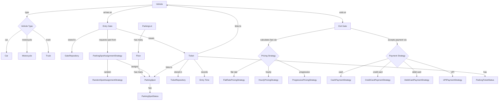
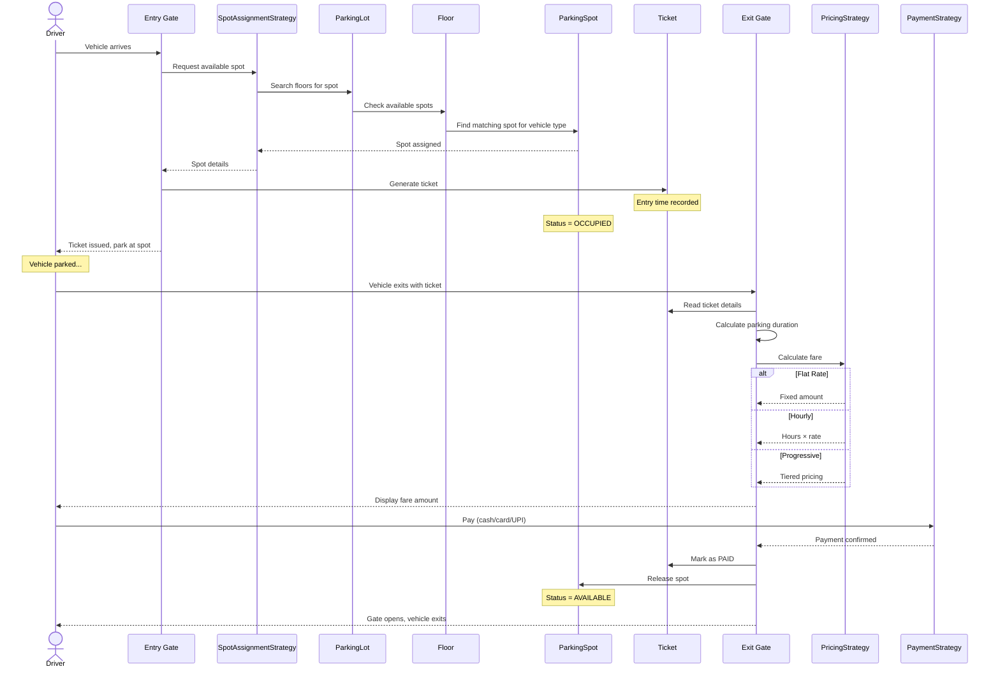

# Parking Lot

## Data Flow Diagram

```mermaid
graph TD
    Vehicle[Vehicle] -->|arrives at| EntryGate[Entry Gate]
    Vehicle -->|type| VehicleType{Vehicle Type}
    VehicleType -->|car| Car[Car]
    VehicleType -->|motorcycle| Motorcycle[Motorcycle]
    VehicleType -->|truck| Truck[Truck]

    EntryGate -->|stored in| GateRepository[GateRepository]
    EntryGate -->|requests spot from| SpotStrategy[ParkingSpotAssignmentStrategy]
    SpotStrategy -->|random| RandomStrategy[RandomSpotAssignmentStrategy]

    ParkingLot[ParkingLot] -->|has many| Floor[Floor]
    Floor -->|has many| ParkingSpot[ParkingSpot]
    ParkingSpot -->|has| SpotStatus[ParkingSpotStatus]

    SpotStrategy -->|assigns| ParkingSpot
    EntryGate -->|issues| Ticket[Ticket]
    Ticket -->|stored in| TicketRepository[TicketRepository]
    Ticket -->|records| EntryTime[Entry Time]
    Ticket -->|links to| ParkingSpot
    Ticket -->|links to| Vehicle

    Vehicle -->|exits at| ExitGate[Exit Gate]
    ExitGate -->|calculates fare via| PricingStrategy{Pricing Strategy}
    PricingStrategy -->|flat rate| FlatRate[FlatRatePricingStrategy]
    PricingStrategy -->|hourly| Hourly[HourlyPricingStrategy]
    PricingStrategy -->|progressive| Progressive[ProgressivePricingStrategy]

    ExitGate -->|accepts payment via| PaymentStrategy{Payment Strategy}
    PaymentStrategy -->|cash| Cash[CashPaymentStrategy]
    PaymentStrategy -->|credit card| CreditCard[CreditCardPaymentStrategy]
    PaymentStrategy -->|debit card| DebitCard[DebitCardPaymentStrategy]
    PaymentStrategy -->|UPI| UPI[UPIPaymentStrategy]

    Ticket -->|has| TicketStatus[ParkingTicketStatus]
```

## User Flow Diagram

```mermaid
sequenceDiagram
    actor Driver
    participant EntryGate as Entry Gate
    participant SpotStrategy as SpotAssignmentStrategy
    participant ParkingLot
    participant Floor
    participant ParkingSpot
    participant Ticket
    participant ExitGate as Exit Gate
    participant PricingStrategy
    participant PaymentStrategy

    Driver->>EntryGate: Vehicle arrives
    EntryGate->>SpotStrategy: Request available spot
    SpotStrategy->>ParkingLot: Search floors for spot
    ParkingLot->>Floor: Check available spots
    Floor->>ParkingSpot: Find matching spot for vehicle type
    ParkingSpot-->>SpotStrategy: Spot assigned

    SpotStrategy-->>EntryGate: Spot details
    EntryGate->>Ticket: Generate ticket
    Note over Ticket: Entry time recorded
    Note over ParkingSpot: Status = OCCUPIED
    EntryGate-->>Driver: Ticket issued, park at spot

    Note over Driver: Vehicle parked...

    Driver->>ExitGate: Vehicle exits with ticket
    ExitGate->>Ticket: Read ticket details
    ExitGate->>ExitGate: Calculate parking duration

    ExitGate->>PricingStrategy: Calculate fare
    alt Flat Rate
        PricingStrategy-->>ExitGate: Fixed amount
    else Hourly
        PricingStrategy-->>ExitGate: Hours × rate
    else Progressive
        PricingStrategy-->>ExitGate: Tiered pricing
    end

    ExitGate-->>Driver: Display fare amount
    Driver->>PaymentStrategy: Pay (cash/card/UPI)
    PaymentStrategy-->>ExitGate: Payment confirmed

    ExitGate->>Ticket: Mark as PAID
    ExitGate->>ParkingSpot: Release spot
    Note over ParkingSpot: Status = AVAILABLE
    ExitGate-->>Driver: Gate opens, vehicle exits
```
