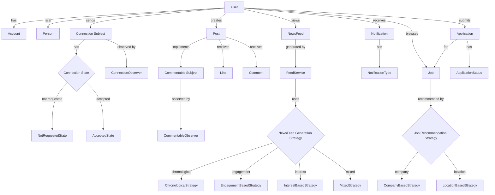
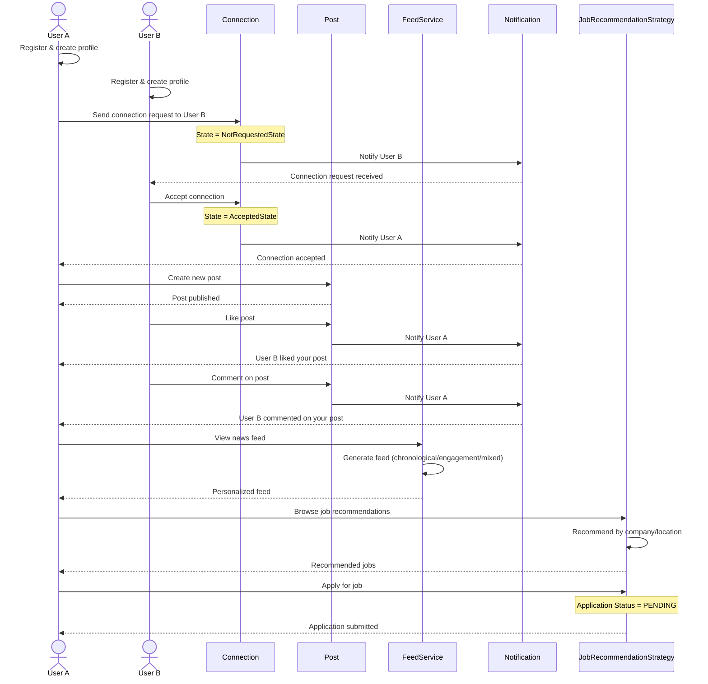

# Social Networking Service

## Data Flow Diagram

```mermaid
graph TD
    User[User] -->|has| Account[Account]
    User -->|is a| Person[Person]

    User -->|sends| Connection[Connection Subject]
    Connection -->|has| ConnectionState{Connection State}
    ConnectionState -->|not requested| NotRequested[NotRequestedState]
    ConnectionState -->|accepted| Accepted[AcceptedState]
    Connection -->|observed by| ConnectionObserver[ConnectionObserver]

    User -->|creates| Post[Post]
    Post -->|implements| Commentable[Commentable Subject]
    Post -->|receives| Like[Like]
    Post -->|receives| Comment[Comment]
    Commentable -->|observed by| CommentableObserver[CommentableObserver]

    User -->|views| Feed[NewsFeed]
    Feed -->|generated by| FeedService[FeedService]
    FeedService -->|uses| FeedStrategy{NewsFeed Generation Strategy}
    FeedStrategy -->|chronological| Chronological[ChronologicalStrategy]
    FeedStrategy -->|engagement| Engagement[EngagementBasedStrategy]
    FeedStrategy -->|interest| Interest[InterestBasedStrategy]
    FeedStrategy -->|mixed| Mixed[MixedStrategy]

    User -->|receives| Notification[Notification]
    Notification -->|has| NotificationType[NotificationType]

    User -->|browses| Job[Job]
    Job -->|recommended by| JobStrategy{Job Recommendation Strategy}
    JobStrategy -->|company| CompanyBased[CompanyBasedStrategy]
    JobStrategy -->|location| LocationBased[LocationBasedStrategy]

    User -->|submits| Application[Application]
    Application -->|has| ApplicationStatus[ApplicationStatus]
    Application -->|for| Job
```

## User Flow Diagram

```mermaid
sequenceDiagram
    actor User1 as User A
    actor User2 as User B
    participant Connection
    participant Post
    participant FeedService
    participant Notification
    participant JobService as JobRecommendationStrategy

    User1->>User1: Register & create profile
    User2->>User2: Register & create profile

    User1->>Connection: Send connection request to User B
    Note over Connection: State = NotRequestedState
    Connection->>Notification: Notify User B
    Notification-->>User2: Connection request received

    User2->>Connection: Accept connection
    Note over Connection: State = AcceptedState
    Connection->>Notification: Notify User A
    Notification-->>User1: Connection accepted

    User1->>Post: Create new post
    Post-->>User1: Post published

    User2->>Post: Like post
    Post->>Notification: Notify User A
    Notification-->>User1: User B liked your post

    User2->>Post: Comment on post
    Post->>Notification: Notify User A
    Notification-->>User1: User B commented on your post

    User1->>FeedService: View news feed
    FeedService->>FeedService: Generate feed (chronological/engagement/mixed)
    FeedService-->>User1: Personalized feed

    User1->>JobService: Browse job recommendations
    JobService->>JobService: Recommend by company/location
    JobService-->>User1: Recommended jobs

    User1->>JobService: Apply for job
    Note over JobService: Application Status = PENDING
    JobService-->>User1: Application submitted
```
