# 🎨 Splitwise Architecture - Visual Image Diagram

## 📊 Complete System Architecture

```mermaid
graph TB
    %% Service Layer
    subgraph "🔧 Service Layer"
        SWS[SplitWiseService<br/>Singleton + Facade]
        US[UserService]
        GS[GroupService]
    end
    
    %% Domain Layer
    subgraph "👥 Domain Layer"
        U[User<br/>Observer]
        G[Group<br/>GroupSubject]
        E[Expense<br/>ExpenseSubject]
        T[Transaction<br/>TransactionSubject]
        BS[BalanceSheet<br/>Thread-safe]
        S[Split]
    end
    
    %% Strategy Layer
    subgraph "⚙️ Strategy Layer"
        SS[SplitStrategy<br/>Abstract]
        ESS[EqualSplitStrategy]
        PSS[PercentSplitStrategy]
        EXSS[ExactSplitStrategy]
    end
    
    %% Builder Layer
    subgraph "🔨 Builder Layer"
        EB[ExpenseBuilder<br/>Builder Pattern]
    end
    
    %% Observer Layer
    subgraph "👁️ Observer Layer"
        O[Observer<br/>Abstract]
        GS2[GroupSubject]
        ES[ExpenseSubject]
        TS[TransactionSubject]
    end
    
    %% Enums
    subgraph "📋 Enums"
        ST[SplitType<br/>EQUAL, EXACT, PERCENTAGE]
        TS2[TransactionStatus<br/>PENDING, COMPLETED, FAILED]
    end
    
    %% Relationships
    SWS --> US
    SWS --> GS
    US --> U
    GS --> G
    
    U --> BS
    U --> G
    G --> E
    E --> S
    E --> U
    T --> U
    S --> U
    
    E --> SS
    SS --> ESS
    SS --> PSS
    SS --> EXSS
    
    EB --> E
    EB --> SS
    
    U -.-> O
    G -.-> GS2
    E -.-> ES
    T -.-> TS
    
    E --> ST
    T --> TS2
    
    %% Styling
    classDef serviceClass fill:#e1f5fe,stroke:#01579b,stroke-width:2px
    classDef domainClass fill:#f3e5f5,stroke:#4a148c,stroke-width:2px
    classDef strategyClass fill:#e8f5e8,stroke:#1b5e20,stroke-width:2px
    classDef builderClass fill:#fff3e0,stroke:#e65100,stroke-width:2px
    classDef observerClass fill:#fce4ec,stroke:#880e4f,stroke-width:2px
    classDef enumClass fill:#f1f8e9,stroke:#33691e,stroke-width:2px
    
    class SWS,US,GS serviceClass
    class U,G,E,T,BS,S domainClass
    class SS,ESS,PSS,EXSS strategyClass
    class EB builderClass
    class O,GS2,ES,TS observerClass
    class ST,TS2 enumClass
```



## 🔄 Data Flow Diagram


## 🎭 Design Patterns Visualization

```mermaid
graph LR
    subgraph "🔒 Singleton Pattern"
        SWS1[SplitWiseService<br/>_instance: static<br/>_lock: Lock<br/>get_instance(): static]
    end
    
    subgraph "🏛️ Facade Pattern"
        SWS2[SplitWiseService<br/>Simplified Interface]
        US2[UserService<br/>Complex Operations]
        GS2[GroupService<br/>Complex Operations]
        SWS2 --> US2
        SWS2 --> GS2
    end
    
    subgraph "⚙️ Strategy Pattern"
        SS2[SplitStrategy<br/>Abstract]
        ESS2[EqualSplitStrategy<br/>calculate_splits()]
        PSS2[PercentSplitStrategy<br/>calculate_splits()]
        EXSS2[ExactSplitStrategy<br/>calculate_splits()]
        SS2 --> ESS2
        SS2 --> PSS2
        SS2 --> EXSS2
    end
    
    subgraph "👁️ Observer Pattern"
        O2[Observer<br/>update()]
        S2[Subject<br/>notify_observers()]
        U2[User<br/>implements Observer]
        G2[Group<br/>extends GroupSubject]
        E2[Expense<br/>extends ExpenseSubject]
        T2[Transaction<br/>extends TransactionSubject]
        
        O2 --> U2
        S2 --> G2
        S2 --> E2
        S2 --> T2
        G2 -.-> U2
        E2 -.-> U2
        T2 -.-> U2
    end
    
    subgraph "🔨 Builder Pattern"
        EB2[ExpenseBuilder<br/>set_description()<br/>set_amount()<br/>set_paid_by()<br/>set_participants()<br/>set_split_strategy()<br/>build()]
        E3[Expense<br/>Complex Object]
        EB2 --> E3
    end
    
    %% Styling
    classDef singleton fill:#ffcdd2,stroke:#d32f2f,stroke-width:2px
    classDef facade fill:#c8e6c9,stroke:#388e3c,stroke-width:2px
    classDef strategy fill:#bbdefb,stroke:#1976d2,stroke-width:2px
    classDef observer fill:#f8bbd9,stroke:#c2185b,stroke-width:2px
    classDef builder fill:#fff9c4,stroke:#f9a825,stroke-width:2px
    
    class SWS1 singleton
    class SWS2,US2,GS2 facade
    class SS2,ESS2,PSS2,EXSS2 strategy
    class O2,S2,U2,G2,E2,T2 observer
    class EB2,E3 builder
```

## 🧮 Advanced Features Diagram

```mermaid
graph TD
    subgraph "🧮 Debt Simplification Algorithm"
        Expenses[Multiple Expenses] --> NetBalances[Calculate Net Balances]
        NetBalances --> CreateHeaps[Create Min-Heaps<br/>Creditors & Debtors]
        CreateHeaps --> OptimalPairs[Find Optimal Pairs<br/>Creditor-Debtor]
        OptimalPairs --> GenerateTransactions[Generate Minimal<br/>Transactions]
        GenerateTransactions --> SimplifiedDebts[Simplified Debt Structure]
    end
    
    subgraph "🔒 Thread Safety"
        ConcurrentAccess[Concurrent Balance Updates] --> Lock[Lock Mechanism]
        Lock --> BalanceSheet[BalanceSheet<br/>Thread-safe Operations]
        BalanceSheet --> DataConsistency[Data Consistency<br/>Maintained]
    end
    
    subgraph "📢 Real-time Notifications"
        EventOccurs[Event Occurs] --> SubjectNotifies[Subject Notifies]
        SubjectNotifies --> ObserverUpdates[Observer Updates]
        ObserverUpdates --> UserNotification[User Receives<br/>Real-time Notification]
    end
    
    subgraph "✅ Input Validation"
        UserInput[User Input] --> BuilderValidation[Builder Validation]
        BuilderValidation --> StrategyValidation[Strategy Validation]
        StrategyValidation --> ValidObject[Valid Object Created]
    end
    
    %% Styling
    classDef algorithm fill:#e3f2fd,stroke:#0277bd,stroke-width:2px
    classDef safety fill:#e8f5e8,stroke:#2e7d32,stroke-width:2px
    classDef notification fill:#fce4ec,stroke:#c2185b,stroke-width:2px
    classDef validation fill:#fff3e0,stroke:#ef6c00,stroke-width:2px
    
    class Expenses,NetBalances,CreateHeaps,OptimalPairs,GenerateTransactions,SimplifiedDebts algorithm
    class ConcurrentAccess,Lock,BalanceSheet,DataConsistency safety
    class EventOccurs,SubjectNotifies,ObserverUpdates,UserNotification notification
    class UserInput,BuilderValidation,StrategyValidation,ValidObject validation
```



## 📊 Component Interaction Matrix


## 🎯 Key Metrics & Statistics


## 🚀 Performance Metrics

```mermaid
graph LR
    subgraph "⚡ Performance Characteristics"
        ExpenseCreation[Expense Creation<br/>~1ms per expense]
        BalanceCalculation[Balance Calculation<br/>~0.1ms per user]
        DebtSimplification[Debt Simplification<br/>~5ms for 10 users]
        ConcurrentOps[Concurrent Operations<br/>100+ simultaneous]
        
        ExpenseCreation --> Performance[Overall Performance]
        BalanceCalculation --> Performance
        DebtSimplification --> Performance
        ConcurrentOps --> Performance
    end
    
    %% Styling
    classDef performance fill:#e8f5e8,stroke:#2e7d32,stroke-width:2px
    class ExpenseCreation,BalanceCalculation,DebtSimplification,ConcurrentOps,Performance performance
```



This comprehensive visual diagram provides multiple perspectives of your Splitwise architecture:

1. **🏗️ Complete System Architecture** - Shows all components and their relationships
2. **🔄 Data Flow Diagram** - Illustrates how requests flow through the system
3. **🎭 Design Patterns Visualization** - Highlights each design pattern implementation
4. **🧮 Advanced Features Diagram** - Shows complex algorithms and features
5. **📊 Component Interaction Matrix** - Displays component relationships
6. **📈 Metrics & Statistics** - Provides quantitative insights

These Mermaid diagrams will render as actual images when viewed in GitHub or any Mermaid-compatible viewer! 🎉✨
