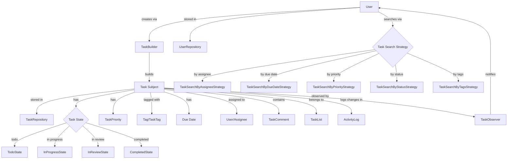
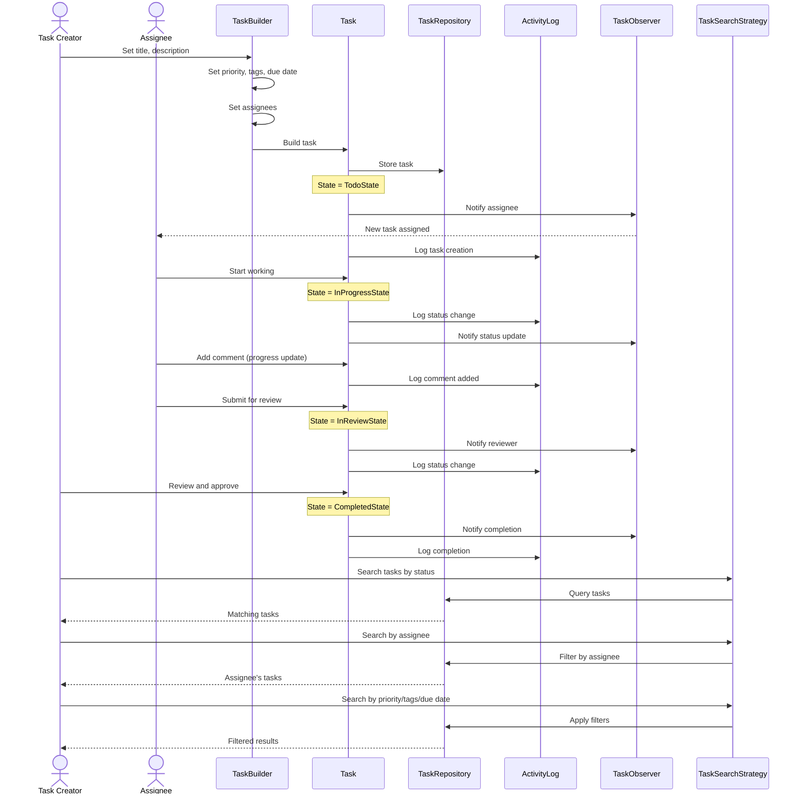

# Task Management System

## Data Flow Diagram

```mermaid
graph TD
    User[User] -->|creates via| TaskBuilder[TaskBuilder]
    TaskBuilder -->|builds| Task[Task Subject]
    Task -->|stored in| TaskRepository[TaskRepository]
    User -->|stored in| UserRepository[UserRepository]

    Task -->|has| TaskState{Task State}
    TaskState -->|todo| TodoState[TodoState]
    TaskState -->|in progress| InProgressState[InProgressState]
    TaskState -->|in review| InReviewState[InReviewState]
    TaskState -->|completed| CompletedState[CompletedState]

    Task -->|has| Priority[TaskPriority]
    Task -->|tagged with| Tag[Tag/TaskTag]
    Task -->|has| DueDate[Due Date]
    Task -->|assigned to| Assignee[User/Assignee]

    Task -->|contains| TaskComment[TaskComment]
    Task -->|belongs to| TaskList[TaskList]
    Task -->|logs changes in| ActivityLog[ActivityLog]

    Task -->|observed by| TaskObserver[TaskObserver]
    TaskObserver -->|notifies| User

    User -->|searches via| SearchStrategy{Task Search Strategy}
    SearchStrategy -->|by assignee| AssigneeSearch[TaskSearchByAssigneeStrategy]
    SearchStrategy -->|by due date| DueDateSearch[TaskSearchByDueDateStrategy]
    SearchStrategy -->|by priority| PrioritySearch[TaskSearchByPriorityStrategy]
    SearchStrategy -->|by status| StatusSearch[TaskSearchByStatusStrategy]
    SearchStrategy -->|by tags| TagsSearch[TaskSearchByTagsStrategy]
```

## User Flow Diagram

```mermaid
sequenceDiagram
    actor Creator as Task Creator
    actor Assignee
    participant TaskBuilder
    participant Task
    participant TaskRepo as TaskRepository
    participant ActivityLog
    participant Observer as TaskObserver
    participant Search as TaskSearchStrategy

    Creator->>TaskBuilder: Set title, description
    TaskBuilder->>TaskBuilder: Set priority, tags, due date
    TaskBuilder->>TaskBuilder: Set assignees
    TaskBuilder->>Task: Build task
    Task->>TaskRepo: Store task
    Note over Task: State = TodoState

    Task->>Observer: Notify assignee
    Observer-->>Assignee: New task assigned
    Task->>ActivityLog: Log task creation

    Assignee->>Task: Start working
    Note over Task: State = InProgressState
    Task->>ActivityLog: Log status change
    Task->>Observer: Notify status update

    Assignee->>Task: Add comment (progress update)
    Task->>ActivityLog: Log comment added

    Assignee->>Task: Submit for review
    Note over Task: State = InReviewState
    Task->>Observer: Notify reviewer
    Task->>ActivityLog: Log status change

    Creator->>Task: Review and approve
    Note over Task: State = CompletedState
    Task->>Observer: Notify completion
    Task->>ActivityLog: Log completion

    Creator->>Search: Search tasks by status
    Search->>TaskRepo: Query tasks
    TaskRepo-->>Creator: Matching tasks

    Creator->>Search: Search by assignee
    Search->>TaskRepo: Filter by assignee
    TaskRepo-->>Creator: Assignee's tasks

    Creator->>Search: Search by priority/tags/due date
    Search->>TaskRepo: Apply filters
    TaskRepo-->>Creator: Filtered results
```
